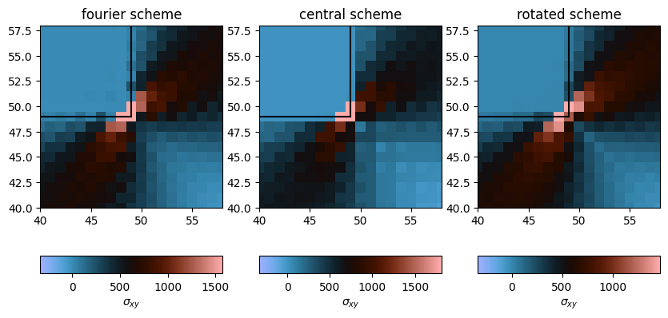

<div class="nb-header"><a href="https://colab.research.google.com/github/smec-ethz/xpektra/blob/main/notebooks/differential_operator.ipynb" target="_blank"></a><a href="/assets/notebooks/differential_operator.ipynb" download="differential_operator.ipynb" class="nb-download-btn"><svg class="nb-download-icon" viewBox="0 0 24 24" xmlns="http://www.w3.org/2000/svg"><path d="M12 16l-6-6 1.41-1.41L11 13.17V4h2v9.17l3.59-3.58L18 11l-6 6z"/><path d="M5 18h14v2H5z"/></svg> Download</a></div>

# Gibbs Ringing Artifact

In this example, we see the effect of Gibbs ringing artifact on the stress field. The original FFT methods used a **spectral** derivative ($D_k = i\xi_k$). This scheme has "global support," meaning the derivative at one point depends on *all* other points. At sharp material interfaces, this causes the **Gibbs phenomenon**, which appears as spurious oscillations ("ringing") in the stress/strain fields.

In this notebook, we solve the same problem using a local scheme

* `CentralDifference`: This scheme is mathematically equivalent to a **Linear Finite Element (LFE)** formulation on a regular grid. It is extremely effective at eliminating ringing artifacts and is highly recommended.
* `RotatedDifference`: This scheme (from Willot, 2015) is equivalent to a trilinear Finite Element formulation with **reduced integration** (like `HEX8R`). It is also very stable and robust.


```python
import jax

jax.config.update("jax_enable_x64", True)  # use double-precision

import jax.numpy as jnp
```


```python
import matplotlib.pyplot as plt
import numpy as np
from jax import Array
from mpl_toolkits.axes_grid1 import make_axes_locatable
from skimage.morphology import footprint_rectangle as rectangle
from soldis.linear import CG
from soldis.newton import NewtonSolver, NewtonSolverOptions

from xpektra import (
    FFTTransform,
    GalerkinProjection,
    SpectralOperator,
    SpectralSpace,
    make_field,
)
```

In `xpektra`, we can import various schemes from the `scheme` module.


```python
from xpektra.scheme import (
    CentralDifference,
    FourierScheme,
    RotatedDifference,
)
```


```python
def param(X, soft, hard):
    return soft * jnp.ones_like(X) * (X) + hard * jnp.ones_like(X) * (1 - X)


def test_microstructure(N, scheme, length):
    H, L = (N, N)
    r = int(H / 2)

    structure = np.zeros((H, L))
    structure[:r, -r:] += rectangle((r, r))
    structure = np.flipud(structure)
    structure = np.fliplr(structure)

    ndim = len(structure.shape)
    N = structure.shape[0]

    fft_transform = FFTTransform(dim=ndim)
    space = SpectralSpace(
        lengths=(length,) * ndim, shape=structure.shape, transform=fft_transform
    )

    if scheme == "rotated":
        scheme = RotatedDifference(space=space)
    elif scheme == "fourier":
        scheme = FourierScheme(space=space)
    elif scheme == "central":
        scheme = CentralDifference(space=space)
    else:
        raise ValueError(f"Invalid scheme: {scheme}")

    op = SpectralOperator(scheme=scheme, space=space, projection=GalerkinProjection())

    # material parameters
    phase_contrast = 1000.0

    # lames constant
    lambda_modulus = {"soft": 1.0, "hard": phase_contrast}
    shear_modulus = {"soft": 1.0, "hard": phase_contrast}

    bulk_modulus = {}
    bulk_modulus["soft"] = lambda_modulus["soft"] + 2 * shear_modulus["soft"] / 3
    bulk_modulus["hard"] = lambda_modulus["hard"] + 2 * shear_modulus["hard"] / 3

    # material parameters
    μ0 = param(
        structure, soft=shear_modulus["soft"], hard=shear_modulus["hard"]
    )  # shear     modulus
    λ0 = param(
        structure, soft=lambda_modulus["soft"], hard=lambda_modulus["hard"]
    )  # shear     modulus

    dofs_shape = make_field(dim=ndim, shape=structure.shape, rank=2).shape

    @jax.jit
    def strain_energy(eps_flat: Array) -> Array:
        eps = eps_flat.reshape(dofs_shape)
        eps_sym = 0.5 * (eps + op.trans(eps))
        energy = 0.5 * jnp.multiply(λ0, op.trace(eps_sym) ** 2) + jnp.multiply(
            μ0, op.trace(op.dot(eps_sym, eps_sym))
        )
        return energy.sum()

    compute_stress = jax.jacrev(strain_energy)

    @jax.jit
    def residual_fn(eps_fluc_flat: Array, macro_strain: Array) -> Array:
        """
        This makes instances of this class behave like a function.
        It takes only the flattened vector of unknowns, as required by the solver.
        """
        eps_fluc = eps_fluc_flat.reshape(dofs_shape)
        eps_macro = jnp.zeros(dofs_shape)
        eps_macro = eps_macro.at[..., 0, 1].set(macro_strain)
        eps_macro = eps_macro.at[..., 1, 0].set(macro_strain)

        eps_total = eps_fluc + eps_macro

        sigma = compute_stress(eps_total)  # Assumes compute_stress is defined elsewhere
        residual_field = op.inverse(op.project(op.forward(sigma.reshape(dofs_shape))))
        return jnp.real(residual_field).reshape(-1)

    solver = NewtonSolver(
        residual_fn,
        lin_solver=CG(),
        options=NewtonSolverOptions(tol=1e-8, maxiter=20, verbose=True),
    )

    macro_strain = 5e-1
    eps_fluc_init = make_field(dim=2, shape=structure.shape, rank=2)

    state = solver.root(eps_fluc_init.reshape(-1), macro_strain)
    deps_fluc = state.value.reshape(dofs_shape)

    # update fluctuation strain
    eps_fluc = eps_fluc_init + deps_fluc.reshape(dofs_shape)

    # total strain
    eps = eps_fluc + jnp.eye(ndim)[None, None, :, :] * macro_strain

    sig = compute_stress(eps.reshape(-1)).reshape(dofs_shape)

    return sig.at[:, :, 0, 1].get(), structure
```


```python
N = 99
length = 1


fig, axs = plt.subplots(1, 3, figsize=(10, 5))


for index, scheme in enumerate(["fourier", "central", "rotated"]):
    sig_xy, structure = test_microstructure(N=N, scheme=scheme, length=length)
    dx = length / N
    N_inset = int(0.1 / dx)

    cb = axs[index].imshow(
        sig_xy,
        origin="lower",
        cmap="berlin",
    )
    axs[index].set_title(f"{scheme} scheme")

    axs[index].set_xlim(int(N / 2) - N_inset, int(N / 2) + N_inset)
    axs[index].set_ylim(int(N / 2) - N_inset, int(N / 2) + N_inset)
    axs[index].plot(
        [int(N / 2) - N_inset, int(N / 2)],
        [int(N / 2), int(N / 2)],
        color="k",
        zorder=20,
    )
    axs[index].plot(
        [int(N / 2), int(N / 2)],
        [int(N / 2), int(N / 2) + N_inset],
        color="k",
        zorder=20,
    )

    divider = make_axes_locatable(axs[index])
    cax = divider.append_axes("bottom", size="10%", pad=0.6)
    fig.colorbar(
        cb, cax=cax, label=r"$\sigma_{xy}$", orientation="horizontal", location="bottom"
    )

plt.show()
```

    CG error = 1809191201.65288829803467
    CG error = 180711.28018052203697
    CG error = 46714.20145051593863
    CG error = 14617.25232148401119
    CG error = 5832.59698513089097
    CG error = 2431.65598926188977
    CG error = 3116.29740077978477
    CG error = 614.33968567417730
    CG error = 952.91201451378811
    CG error = 127.43347812995538
    CG error = 219.72885043808103
    CG error = 30.34384937912854
    CG error = 53.54063847293286
    CG error = 7.48889951501528
    CG error = 13.38287004868258
    CG error = 1.88468977537643
    CG error = 3.38704753366071
    CG error = 0.47806966030197
    CG error = 0.83063693820718
    CG error = 0.10407914602798
    Didnot converge, Residual value : 0.4302411050563448
    CG error = 1809191201.65286087989807
    CG error = 30528.61295431769031
    CG error = 410.36880422420364
    CG error = 33.62624023735062
    CG error = 1.81363087903672
    CG error = 0.26855517956802
    CG error = 0.01572767915948
    CG error = 0.00364347008115
    CG error = 0.00026425956375
    CG error = 0.00004561819059
    CG error = 0.00000353302146
    CG error = 0.00000065830433
    CG error = 0.00000005500087
    CG error = 0.00000001175910
    CG error = 0.00000000134181
    CG error = 0.00000000028057
    CG error = 0.00000000003430
    CG error = 0.00000000000619
    CG error = 0.00000000000074
    CG error = 0.00000000000010
    Didnot converge, Residual value : 1.1374537107621268e-07
    CG error = 1809191201.65287327766418
    CG error = 1.25285005834628
    CG error = 0.00001036363130
    CG error = 0.00000002019141
    CG error = 0.00000000000601
    CG error = 0.00000000000006
    CG error = 0.00000000000000
    CG error = 0.00000000000000
    CG error = 0.00000000000000
    CG error = 0.00000000000000
    CG error = 0.00000000000000
    CG error = 0.00000000000000
    CG error = 0.00000000000000
    CG error = 0.00000000000000
    CG error = 0.00000000000000
    CG error = 0.00000000000000
    CG error = 0.00000000000000
    CG error = 0.00000000000000
    CG error = 0.00000000000000
    CG error = 0.00000000000000
    Didnot converge, Residual value : 7.464999427292982e-09


    

    


```python

```
