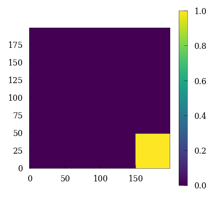
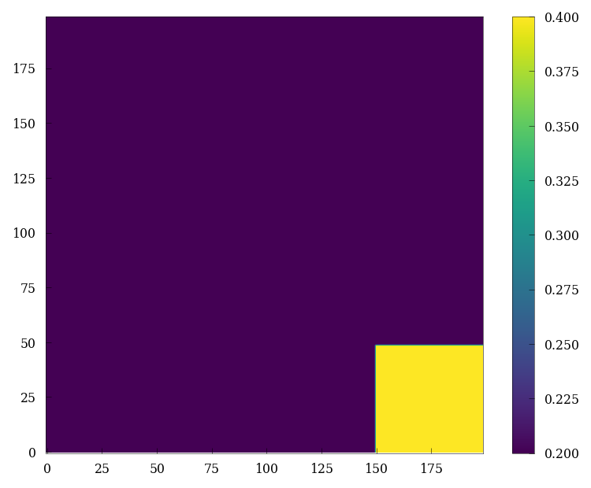
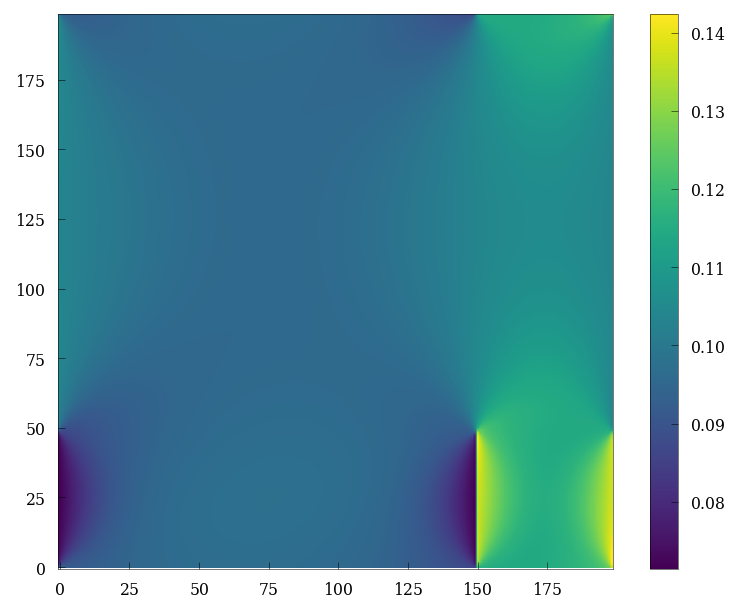
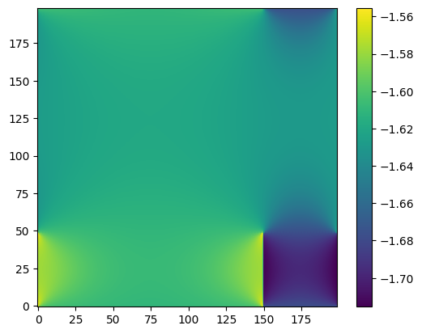
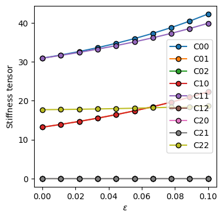

<div class="nb-header"><a href="https://colab.research.google.com/github/smec-ethz/xpektra/blob/main/notebooks/gent.ipynb" target="_blank"></a><a href="/assets/notebooks/gent.ipynb" download="gent.ipynb" class="nb-download-btn"><svg class="nb-download-icon" viewBox="0 0 24 24" xmlns="http://www.w3.org/2000/svg"><path d="M12 16l-6-6 1.41-1.41L11 13.17V4h2v9.17l3.59-3.58L18 11l-6 6z"/><path d="M5 18h14v2H5z"/></svg> Download</a></div>

```python
import jax

jax.config.update("jax_enable_x64", True)  # use double-precision
jax.config.update("jax_platforms", "cpu")
jax.config.update("jax_persistent_cache_min_compile_time_secs", 0)
import jax.numpy as jnp
import numpy as np
from jax import Array
import equinox as eqx
```


```python
import matplotlib.pyplot as plt
from skimage.morphology import disk, rectangle
import itertools
```


```python
import matplotlib.pyplot as plt
```


```python
import sys

from projection_operators import compute_Ghat_4_2
import tensor_operators as tensor

sys.path.append("../plot_helpers/")
plt.style.use(["../plot_helpers/prl_paper.mplstyle"])
from plot_helper_for_paper import plot_contourf, plot_imshow, set_size
```

## constructing a dual phase RVE


```python
H, L = (199, 199)
Hmid = int(H / 2)
Lmid = int(L / 2)
r = 49

structure = np.zeros((H, L))
structure[:r, -r:] += rectangle(r, r)

plt.figure(figsize=(3, 3))
cb = plt.imshow(structure, origin="lower")
plt.colorbar(cb)
```


    <matplotlib.colorbar.Colorbar at 0x14bc89d65210>


    

    


```python
ndim = len(structure.shape)
N = structure.shape[0]

# grid dimensions
shape = [N, N]  # number of voxels in all directions
```

We also define certain Identity tensor for each grid point.

- $\mathbf{I}$ = 2 order Identity tensor with shape `(2, 2, N, N)` 
- $\mathbb{I4}$ = 4 order Identity tensor with shape `(2, 2, 2, 2, N, N)`


```python
# identity tensor (single tensor)
i = jnp.eye(ndim)

# identity tensors (grid)
I = jnp.einsum("ij,xy", i, jnp.ones([N, N]))  # 2nd order Identity tensor
I4 = jnp.einsum(
    "ijkl,xy->ijklxy", jnp.einsum("il,jk", i, i), jnp.ones([N, N])
)  # 4th order Identity tensor
I4rt = jnp.einsum("ijkl,xy->ijklxy", jnp.einsum("ik,jl", i, i), jnp.ones([N, N]))
I4s = (I4 + I4rt) / 2.0

II = tensor.dyad22(I, I)
```

## assigning material parameters 
We assign material parameters to the two phases. The two phases within the RVE are denoted as
- Soft = 0
- Hard = 1


```python
# material parameters + function to convert to grid of scalars
@functools.partial(jax.jit, static_argnames=["soft", "hard"])
def param(X, soft, hard):
    return soft * jnp.ones_like(X) * (X) + hard * jnp.ones_like(X) * (1 - X)
```


```python
# material parameters
shear_modulus = {"hard": 50, "soft": 16}  # N/mm2
jm_modulus = {"hard": 0.2, "soft": 0.4}
```


```python
# material parameters
μ0 = param(
    structure, soft=shear_modulus["soft"], hard=shear_modulus["hard"]
)  # shear     modulus
Jm = param(
    structure, soft=jm_modulus["soft"], hard=jm_modulus["hard"]
)  # shear     modulus
```


```python
plt.imshow(Jm, origin="lower")
plt.colorbar()
```


    <matplotlib.colorbar.Colorbar at 0x14bc89cb4b50>


    

    


```python
Ghat4_2 = compute_Ghat_4_2(NN=(N,) * ndim, operator="fourier", length=1.0)
```


```python
# (inverse) Fourier transform (for each tensor component in each direction)
@jax.jit
def fft(x):
    return jnp.fft.fftshift(jnp.fft.fftn(jnp.fft.ifftshift(x), [N, N]))


@jax.jit
def ifft(x):
    return jnp.fft.fftshift(jnp.fft.ifftn(jnp.fft.ifftshift(x), [N, N]))


# functions for the projection 'G', and the product 'G : K : dF'
@jax.jit
def G(A2):
    return jnp.real(ifft(tensor.ddot42(Ghat4_2, fft(A2)))).reshape(-1)


@jax.jit
def K_dF(dF, K4):
    # jax.debug.print('x={}', K4)
    return tensor.trans2(tensor.ddot42(K4, tensor.trans2(dF.reshape(ndim, ndim, N, N))))


@jax.jit
def G_K_dF(dF, K4):
    return G(K_dF(dF, K4))
```

## gent material

The strain energy function for a `Gent` material (isotropic compresisble hyperelastic material) is given as 
\begin{align}
    \psi = -\dfrac{\mu}{2} \left( J_m \ln \left( 1 - \dfrac{I_1 - 3}{J_m} \right) + 2 \ln(J) \right)
\end{align}

where $I_1 = \text{tr}(B) =  \text{tr}(F^T.F)$ $B$ is the left Cauchy Green deformation gradient

where $J = \text{det}(F)$ is the determinant of deformation gradient

where `E= Green-Lagrange strain tensor` which can be related to the `deformation gradient F` as 
\begin{align}
E = \dfrac{1}{2}(F^{T}.F -I)
\end{align}


```python
# determinant of grid of 2nd-order tensors
@jax.jit
def det2(A2):
    return A2.at[0, 0].get() * A2.at[1, 1].get() - A2.at[0, 1].get() * A2.at[1, 0].get()


@jax.jit
def left_cauchy_green_deformation_tensor(F: ArrayLike) -> Array:
    return tensor.dot22(tensor.trans2(F), F)


@jax.jit
def strain_energy(F: ArrayLike) -> Array:
    B = left_cauchy_green_deformation_tensor(F)
    J = det2(F)
    I1 = tensor.trace2(B)
    energy = -jnp.multiply(
        μ0 / 2.0, jnp.multiply(Jm, jnp.log(1 - jnp.divide(I1 - 3, Jm)) + 2 * jnp.log(J))
    )
    return energy.sum()


piola_kirchhoff = jax.jit(jax.jacrev(strain_energy))
```

Due to the `geometric nonlinearity` in the stress-strain relationship, we use a `Netwon-Raphson` scheme combined with `Conjugate gradient` to solve for the compatible strains within the RVE. 
\begin{align}
    \Delta \sigma_{ij} = \dfrac{\partial \sigma_{ij}(F)}{\partial F_{ij}}\Delta F_{ij}
\end{align}


```python
@functools.partial(jax.jit, static_argnames=["piola_kirchhoff"])
def G_P(dF, additional, piola_kirchhoff):
    dF = dF.reshape(ndim, ndim, N, N)
    tangents = jax.jvp(
        piola_kirchhoff, (additional,), (dF,)
    )[
        1
    ]  ## to compute the jvp at F in the direction of dF to get the correct incremental stress
    return G(tangents)
```


```python
@functools.partial(jax.jit, static_argnames=["A", "K"])
def conjugate_gradient(A, b, additional, K, atol=1e-5):
    b, additional = jax.device_put((b, additional))

    def body_fun(state):
        b, p, r, rsold, x = state
        Ap = A(p, additional, K)
        alpha = rsold / jnp.vdot(p, Ap)
        x = x + jnp.dot(alpha, p)
        r = r - jnp.dot(alpha, Ap)
        rsnew = jnp.vdot(r, r)
        p = r + (rsnew / rsold) * p
        rsold = rsnew
        return (b, p, r, rsold, x)

    def cond_fun(state):
        b, p, r, rsold, x = state
        return jnp.sqrt(rsold) > atol

    x = jnp.zeros_like(b)
    r = b - A(x, additional, K)
    p = r
    rsold = jnp.vdot(r, r)

    b, p, r, rsold, x = jax.lax.while_loop(cond_fun, body_fun, (b, p, r, rsold, x))
    return x
```

## newton raphson method

Here we define a function to solve the hyperelasticity problem using a `newton-raphson` method


```python
@jax.jit
def solve_netwon_raphson(state, n):
    dF, b, F, Fn = state

    error = jnp.linalg.norm(dF) / Fn
    jax.debug.print("residual={}", error)

    def true_fun(state):
        dF, b, F, Fn = state

        dF = conjugate_gradient(
            atol=1e-8,
            A=G_P,
            b=b,
            additional=F,
            K=piola_kirchhoff,
        )  # solve linear system using CG

        dF = dF.reshape(ndim, ndim, N, N)
        F = jax.lax.add(F, dF)  # update DOFs (array -> tens.grid)
        P = piola_kirchhoff(F)  # new residual stress
        b = -G(P)  # convert residual stress to residual

        return (dF, b, F, Fn)

    def false_fun(state):
        return state

    return jax.lax.cond(error > 1e-5, true_fun, false_fun, state), n
```

## solving for a given loaded state 


```python
F = jnp.array(I, copy=True)
P = piola_kirchhoff(F)

# set macroscopic loading
DbarF = jnp.zeros([ndim, ndim, N, N])
DbarF = DbarF.at[0, 1].set(1e-1)

# initial residual: distribute "barF" over grid using "K4"
b = -G_P(DbarF, F, piola_kirchhoff)
F = jax.lax.add(F, DbarF)
Fn = jnp.linalg.norm(F)
```


```python
state = (DbarF, b, F, Fn)
initial_state = jax.device_put(state)
```


```python
final_state, xs = jax.lax.scan(
    solve_netwon_raphson, init=initial_state, xs=jnp.arange(0, 10)
)
```

    residual=0.0705345615858598
    residual=0.008470035538537467
    residual=0.0015565804971452296
    residual=7.856409318335205e-06
    residual=7.856409318335205e-06
    residual=7.856409318335205e-06
    residual=7.856409318335205e-06
    residual=7.856409318335205e-06
    residual=7.856409318335205e-06
    residual=7.856409318335205e-06


```python
plt.imshow(final_state[2].at[0, 1].get(), origin="lower")
plt.colorbar()
```


    <matplotlib.colorbar.Colorbar at 0x14bc7758cb50>


    

    


```python
@jax.jit
def local_constitutive_update(macro_strain):
    # ----------------------------- NEWTON ITERATIONS -----------------------------
    # initialize stress and strain tensor                         [grid of tensors]
    # eps      = jnp.zeros([ndim,ndim,N,N])
    eps = jnp.array(I, copy=True)
    # set macroscopic loading
    DE = jnp.zeros([ndim, ndim, N, N])
    DE = DE.at[0, 0].set(macro_strain[0, 0])
    DE = DE.at[1, 1].set(macro_strain[1, 1])
    DE = DE.at[0, 1].set(macro_strain[0, 1])
    DE = DE.at[1, 0].set(macro_strain[1, 0])

    # initial residual: distribute "DE" over grid using "K4"
    b = -G_P(DE, eps, piola_kirchhoff)
    eps = jax.lax.add(eps, DE)
    En = jnp.linalg.norm(eps)

    state = (DE, b, eps, En)
    initial_state = jax.device_put(state)

    final_state, xs = jax.lax.scan(
        solve_netwon_raphson, init=initial_state, xs=jnp.arange(0, 10)
    )

    DE, b, eps, En = final_state
    P = piola_kirchhoff(eps)

    # get the macro stress
    macro_sigma = jnp.array(
        [
            jnp.mean(P.at[0, 0].get()),
            jnp.mean(P.at[1, 1].get()),
            jnp.mean(P.at[0, 1].get()),
        ]
    )

    return jnp.array(
        [
            [macro_sigma.at[0].get(), macro_sigma.at[2].get() / 2.0],
            [macro_sigma.at[2].get() / 2.0, macro_sigma.at[1].get()],
        ]
    ), (macro_sigma, P, eps)
```


```python
tangent_operator_and_state = jax.jacfwd(
    local_constitutive_update, argnums=0, has_aux=True
)
```


```python
deps = jnp.array([[1e-3, 0], [0, 2e-3]])
```


```python
import timeit
```


```python
start = timeit.default_timer()
tangent, state = tangent_operator_and_state(deps)
print(timeit.default_timer() - start)
```

    residual=0.0015787704773174971
    residual=0.00026910167792174754
    residual=0.001276752994205467
    residual=5.049238385397511e-06
    residual=5.049238385397511e-06
    residual=5.049238385397511e-06
    residual=5.049238385397511e-06
    residual=5.049238385397511e-06
    residual=5.049238385397511e-06
    residual=5.049238385397511e-06
    6.844096690008882


```python
tangent
```


    Array([[[[ 3.11166606e+01, -3.87558978e-17],
             [-1.36363344e-16,  1.33568329e+01]],
    
            [[-1.43540362e-18,  4.02346502e+00],
             [ 4.82959902e+00, -7.17701811e-19]]],
    
    
           [[[-1.43540362e-18,  4.02346502e+00],
             [ 4.82959902e+00, -7.17701811e-19]],
    
            [[ 1.33568329e+01, -7.03347775e-17],
             [-1.30621730e-16,  3.11245167e+01]]]], dtype=float64)


```python
state[0]
```


    Array([-1.62359708e+00, -1.60583333e+00, -3.81279087e-19], dtype=float64)


```python
plt.imshow(state[1].at[0, 0].get(), origin="lower")
plt.colorbar()
```


    <matplotlib.colorbar.Colorbar at 0x15027e4c7910>


    

    


```python
tangents = []
deformations = np.linspace(1e-4, 1e-1, num=10)
for dep in deformations:
    deps = jnp.array([dep, dep / 10.0, 0])
    tangent, state = tangent_operator_and_state(deps)
    tangents.append(tangent)
```

    residual=7.105944367641367e-05
    residual=1.1254206496892181e-05
    residual=0.0012846588038883855
    residual=4.994098703763459e-06
    residual=4.994098703763459e-06
    residual=4.994098703763459e-06
    residual=4.994098703763459e-06
    residual=4.994098703763459e-06
    residual=4.994098703763459e-06
    residual=4.994098703763459e-06
    residual=0.007910268322101562
    residual=0.001228210428898748
    residual=0.001265443412756214
    residual=5.341406599003363e-06
    residual=5.341406599003363e-06
    residual=5.341406599003363e-06
    residual=5.341406599003363e-06
    residual=5.341406599003363e-06
    residual=5.341406599003363e-06
    residual=5.341406599003363e-06
    residual=0.015654348281605543
    residual=0.002379548977299753
    residual=0.0012826900693592355
    residual=6.030296584612204e-06
    residual=6.030296584612204e-06
    residual=6.030296584612204e-06
    residual=6.030296584612204e-06
    residual=6.030296584612204e-06
    residual=6.030296584612204e-06
    residual=6.030296584612204e-06
    residual=0.023304471799337402
    residual=0.003462975697077963
    residual=0.0013358251586461228
    residual=7.164056301436735e-06
    residual=7.164056301436735e-06
    residual=7.164056301436735e-06
    residual=7.164056301436735e-06
    residual=7.164056301436735e-06
    residual=7.164056301436735e-06
    residual=7.164056301436735e-06
    residual=0.030861809464007354
    residual=0.004476473607398727
    residual=0.0014242115496464845
    residual=8.892672791652492e-06
    residual=8.892672791652492e-06
    residual=8.892672791652492e-06
    residual=8.892672791652492e-06
    residual=8.892672791652492e-06
    residual=8.892672791652492e-06
    residual=8.892672791652492e-06
    residual=0.03832752904243944
    residual=0.0054183106644449626
    residual=0.001547100378456015
    residual=1.1425368977391468e-05
    residual=6.755584977595293e-10
    residual=6.755584977595293e-10
    residual=6.755584977595293e-10
    residual=6.755584977595293e-10
    residual=6.755584977595293e-10
    residual=6.755584977595293e-10
    residual=0.045702794609239865
    residual=0.006287046116837518
    residual=0.001703603894744631
    residual=1.5043993749906706e-05
    residual=1.2745002806367327e-09
    residual=1.2745002806367327e-09
    residual=1.2745002806367327e-09
    residual=1.2745002806367327e-09
    residual=1.2745002806367327e-09
    residual=1.2745002806367327e-09
    residual=0.052988765736600496
    residual=0.007081535415543497
    residual=0.001892702062825208
    residual=2.0116950452922185e-05
    residual=2.4761875686840024e-09
    residual=2.4761875686840024e-09
    residual=2.4761875686840024e-09
    residual=2.4761875686840024e-09
    residual=2.4761875686840024e-09
    residual=2.4761875686840024e-09
    residual=0.06018659674136359
    residual=0.007800933661451986
    residual=0.0021132751259526497
    residual=2.7113417615227308e-05
    residual=4.883446763811611e-09
    residual=4.883446763811611e-09
    residual=4.883446763811611e-09
    residual=4.883446763811611e-09
    residual=4.883446763811611e-09
    residual=4.883446763811611e-09
    residual=0.06729743598654882
    residual=0.008444697595858062
    residual=0.0023641478359727394
    residual=3.6617653213283884e-05
    residual=9.667248978383054e-09
    residual=9.667248978383054e-09
    residual=9.667248978383054e-09
    residual=9.667248978383054e-09
    residual=9.667248978383054e-09
    residual=9.667248978383054e-09


```python
plt.figure(figsize=(4, 4))
for i in range(0, 3):
    for j in range(0, 3):
        C = [tang[i, j] for tang in tangents]
        plt.plot(deformations, C, marker="o", label=f"C{i}{j}", markeredgecolor="k")

plt.ylabel(r"$\text{Stiffness tensor}$")
plt.xlabel(r"$\varepsilon$")
plt.legend()
plt.savefig("./figs/paper_gent_tangent_stiffness.pdf", dpi=200)
plt.show()
```


    

    


```python

```
