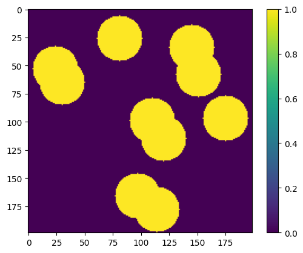

<div class="nb-header"><a href="https://colab.research.google.com/github/smec-ethz/xpektra/blob/main/notebooks/j2_plasticity.ipynb" target="_blank"></a><a href="/assets/notebooks/j2_plasticity.ipynb" download="j2_plasticity.ipynb" class="nb-download-btn"><svg class="nb-download-icon" viewBox="0 0 24 24" xmlns="http://www.w3.org/2000/svg"><path d="M12 16l-6-6 1.41-1.41L11 13.17V4h2v9.17l3.59-3.58L18 11l-6 6z"/><path d="M5 18h14v2H5z"/></svg> Download</a></div>

```python
from re import A

import jax

jax.config.update("jax_enable_x64", True)
```


```python
import random

import equinox as eqx
import jax.numpy as jnp
import matplotlib.pyplot as plt
import numpy as np
from jax import Array
from scipy.spatial.distance import cdist
from soldis.linear import CG
from soldis.newton import (
    LineSearchNewtonSolver,
    LineSearchNewtonSolverOptions,
    NewtonSolver,
    NewtonSolverOptions,
)
```


```python
from xpektra import (
    FFTTransform,
    GalerkinProjection,
    SpectralOperator,
    SpectralSpace,
    make_field,
)
from xpektra.scheme import RotatedDifference

random.seed(1)


def place_circle(matrix, n, r, x_center, y_center):
    for i in range(n):
        for j in range(n):
            if (i - x_center) ** 2 + (j - y_center) ** 2 <= r**2:
                matrix[i][j] = 1


def generate_matrix_with_circles(n, x, r):
    if r >= n:
        raise ValueError("Radius r must be less than the size of the matrix n")

    matrix = np.zeros((n, n), dtype=int)
    placed_circles = 0

    while placed_circles < x:
        x_center = random.randint(0, n - 1)
        y_center = random.randint(0, n - 1)

        # Check if the circle fits within the matrix bounds
        if (
            x_center + r < n
            and y_center + r < n
            and x_center - r >= 0
            and y_center - r >= 0
        ):
            previous_matrix = matrix.copy()
            place_circle(matrix, n, r, x_center, y_center)
            if not np.array_equal(previous_matrix, matrix):
                placed_circles += 1

    return matrix


N = 99
ndim = 2
length = 1.0

x = 1
r = 20
structure = generate_matrix_with_circles(N, x, r)


cb = plt.imshow(structure, cmap="viridis")
plt.colorbar(cb)
plt.show()
```


    

    


```python
# Helper to map properties to grid
def map_prop(structure, val_soft, val_hard):
    return val_hard * structure + val_soft * (1 - structure)


# Properties
phase_contrast = 2.0
K_field = map_prop(structure, 0.833, phase_contrast * 0.833)
mu_field = map_prop(structure, 0.386, phase_contrast * 0.386)
H_field = map_prop(structure, 0.01, phase_contrast * 0.01)  # Normalized
sigma_y_field = map_prop(structure, 0.003, phase_contrast * 0.003)  # Normalized
n_exponent = 1.0
```


```python
fft_transform = FFTTransform(dim=ndim)
space = SpectralSpace(lengths=(length, length), shape=(N, N), transform=fft_transform)
op = SpectralOperator(
    scheme=RotatedDifference(space=space), space=space, projection=GalerkinProjection()
)

dofs_shape = make_field(dim=ndim, shape=structure.shape, rank=2).shape
```


```python
# Pre-compute Identity Tensors for the grid
# I2: (N,N,2,2), I4_dev: (N,N,2,2,2,2)

i = jnp.eye(ndim)
I = make_field(dim=ndim, shape=structure.shape, rank=ndim) * i  # Broadcasted Identity
II = op.dyad(I, I)  # Fourth-order Identity


class J2Plasticity(eqx.Module):
    """
    Encapsulates the J2 Plasticity constitutive law and return mapping.
    """

    K: Array
    mu: Array
    H: Array
    sigma_y: Array
    n: float

    def yield_stress(self, ep: Array) -> Array:
        return self.sigma_y + self.H * (ep**self.n)

    @jax.jit
    def compute_response(
        self, eps_total: Array, state_prev: tuple[Array, ...]
    ) -> tuple:
        """
        Computes stress and new state variables given total strain and history.
        state_prev = (eps_total_t, eps_elastic_t, ep_t)
        """
        eps_t, epse_t, ep_t = state_prev

        # Trial State (assume elastic step)
        # Delta eps = eps_total - eps_t
        # Trial elastic strain = old elastic strain + Delta eps
        epse_trial = epse_t + (eps_total - eps_t)

        # Volumetric / Deviatoric Split, 2D plane strain
        trace_epse = op.trace(epse_trial)
        epse_dev = epse_trial - (trace_epse[..., None, None] / 2.0) * jnp.eye(2)

        # Note: Be careful with 2D trace. If plane strain, tr=e11+e22.
        # If plane stress, e33 is non-zero. Assuming plane strain for simplicity.

        # Trial Stress
        # sigma_vol = K * trace_epse * I
        # sigma_dev = 2 * mu * epse_dev
        sigma_vol = self.K[..., None, None] * trace_epse[..., None, None] * jnp.eye(2)
        sigma_dev = 2.0 * self.mu[..., None, None] * epse_dev
        sigma_trial = sigma_vol + sigma_dev

        # Mises Stress
        # sig_eq = sqrt(3/2 * s:s)
        norm_s = jnp.sqrt(op.ddot(sigma_dev, sigma_dev))
        sig_eq_trial = jnp.sqrt(1.5) * norm_s

        # 2. Check Yield Condition
        sig_y_current = self.yield_stress(ep_t)
        phi = sig_eq_trial - sig_y_current

        # 3. Return Mapping (if plastic)
        # Mask for plastic points
        is_plastic = phi > 0

        # Plastic Multiplier Delta_gamma
        # Denom = 3*mu + H
        denom = 3.0 * self.mu + self.H  # (Linear hardening H' = H)
        d_gamma = jnp.where(is_plastic, phi / denom, 0.0)

        # Update State
        # Normal vector n = s_trial / |s_trial|
        # s_new = s_trial - 2*mu*d_gamma * n
        # This simplifies to scaling s_trial
        scale_factor = jnp.where(
            is_plastic, 1.0 - (3.0 * self.mu * d_gamma) / sig_eq_trial, 1.0
        )

        sigma_dev_new = sigma_dev * scale_factor[..., None, None]
        sigma_new = sigma_vol + sigma_dev_new

        # Update plastic strain
        ep_new = ep_t + d_gamma

        # Update elastic strain (back-calculate from stress)
        # eps_e_new = eps_e_trial - d_gamma * n * sqrt(3/2) ...
        # Easier: eps_e_new = C_inv : sigma_new
        # Or just update deviatoric part
        epse_dev_new = epse_dev * scale_factor[..., None, None]
        epse_vol_new = trace_epse[..., None, None] * jnp.eye(2)  # Volumetric is elastic
        epse_new = epse_dev_new + epse_vol_new

        return sigma_new, (eps_total, epse_new, ep_new)


# Instantiate Material
material = J2Plasticity(K_field, mu_field, H_field, sigma_y_field, n_exponent)


@jax.jit
def residual_fn(
    eps_fluc_flat: Array,
    macro_strain: Array,
    state_prev: tuple[Array, ...],
    material: J2Plasticity,
) -> Array:
    eps_fluc = eps_fluc_flat.reshape(dofs_shape)
    eps_macro = jnp.zeros(dofs_shape)
    eps_macro = eps_macro.at[:, :, 0, 0].set(macro_strain)
    eps_macro = eps_macro.at[:, :, 1, 1].set(-macro_strain)
    eps_total = eps_fluc + eps_macro

    sigma, _ = material.compute_response(eps_total, state_prev)
    residual_field = op.inverse(op.project(op.forward(sigma.reshape(dofs_shape))))
    return jnp.real(residual_field).reshape(-1)


"""
solver = LineSearchNewtonSolver(
    residual_fn,
    lin_solver=CG(tol=1e-5, maxiter=50),
    options=LineSearchNewtonSolverOptions(tol=1e-8, maxiter=20, verbose=True),
)
"""

solver = NewtonSolver(
    residual_fn,
    lin_solver=CG(tol=1e-5, maxiter=50),
    options=NewtonSolverOptions(tol=1e-8, maxiter=20, verbose=True),
)

# Initialize Fields
# Layout: (N, N, 2, 2)
eps_total = make_field(dim=ndim, shape=structure.shape, rank=2)
eps_elastic = make_field(dim=ndim, shape=structure.shape, rank=2)
ep_accum = make_field(dim=ndim, shape=structure.shape, rank=0)  # Scalar plastic strain
state_current = (eps_total, eps_elastic, ep_accum)
eps_fluc_init = make_field(
    dim=ndim, shape=structure.shape, rank=2
)  # Initial guess for fluctuation

# History storage
stress_history = []

# Load steps
n_steps = 200
max_strain = 0.1 * jnp.sqrt(3) / 2
strain_steps = jnp.linspace(0, max_strain, n_steps)

print("Starting Plasticity Simulation...")

for inc, macro_strain in enumerate(strain_steps[1:13]):
    state = solver.root(
        eps_fluc_init.reshape(-1), macro_strain, state_current, material
    )
    eps_fluc = state.value.reshape(dofs_shape)
    eps_fluc_init = eps_fluc  # initial guess for next step

    # Reconstruct total strain to update history variables
    eps_macro = jnp.zeros(dofs_shape)
    eps_macro = eps_macro.at[:, :, 0, 1].set(macro_strain)
    eps_macro = eps_macro.at[:, :, 1, 0].set(macro_strain)
    eps_total = eps_fluc + eps_macro
    final_sigma, state_current = material.compute_response(eps_total, state_current)

    avg_stress = jnp.mean(final_sigma, axis=(0, 1))
    stress_history.append(avg_stress[0, 1])


# Plot
plt.plot(strain_steps[1:13], stress_history, "-o")
plt.xlabel("Macroscopic Shear Strain")
plt.ylabel("Macroscopic Shear Stress")
plt.title("J2 Plasticity: Stress-Strain Curve")
plt.grid()
plt.show()
```

    Starting Plasticity Simulation...


    epse_trial: (Array(199, dtype=int64), Array(199, dtype=int64), Array(2, dtype=int64), Array(2, dtype=int64))
    trace_epse: (Array(199, dtype=int64), Array(199, dtype=int64), Array(2, dtype=int64), Array(2, dtype=int64))
    epse_trial: (Array(199, dtype=int64), Array(199, dtype=int64), Array(2, dtype=int64), Array(2, dtype=int64))
    trace_epse: (Array(199, dtype=int64), Array(199, dtype=int64), Array(2, dtype=int64), Array(2, dtype=int64))


    ---------------------------------------------------------------------------

    ValueError                                Traceback (most recent call last)

    Cell In[19], line 207
        204     break
        206 # Solve J * dx = -val using CG
    --> 207 dx, _ = conjugate_gradient_while(lin_fn, -val, max_iter=50, atol=1e-5)
        209 # Update
        210 eps_iter = eps_iter + dx.reshape(eps_iter.shape)


        [... skipping hidden 1 frame]


    File ~/Documents/dev/spectralsolvers/.venv/lib/python3.12/site-packages/equinox/_jit.py:263, in _call(jit_wrapper, is_lower, args, kwargs)
        259         marker, _, _ = out = jit_wrapper._cached(
        260             dynamic_donate, dynamic_nodonate, static
        261         )
        262 else:
    --> 263     marker, _, _ = out = jit_wrapper._cached(
        264         dynamic_donate, dynamic_nodonate, static
        265     )
        266 # We need to include the explicit `isinstance(marker, jax.Array)` check due
        267 # to https://github.com/patrick-kidger/equinox/issues/988
        268 if not isinstance(marker, jax.core.Tracer) and isinstance(
        269     marker, jax.Array
        270 ):


    ValueError: Non-hashable static arguments are not supported. An error occurred while trying to hash an object of type <class 'tuple'>, (((<function conjugate_gradient_while at 0x7012d45d6c00>,), PyTreeDef(*)), ((None, None, None, None, None, None, None, None, None, None, None, None, None, None, None, None, None, None, None, TypedNdArray([[[ 0.00000000e+00 +0.j        ,
                     0.00000000e+00 +0.j        ],
                   [ 0.00000000e+00 +0.j        ,
                    -9.91837639e-02 +6.2821414j ],
                   [ 0.00000000e+00 +0.j        ,
                    -3.96636187e-01+12.55802063j],
                   ...,
                   [ 0.00000000e+00 +0.j        ,
                    -8.92060762e-01-18.82138175j],
                   [ 0.00000000e+00 +0.j        ,
                    -3.96636187e-01-12.55802063j],
                   [ 0.00000000e+00 +0.j        ,
                    -9.91837639e-02 -6.2821414j ]],
    
                  [[-9.91837639e-02 +6.2821414j ,
                     0.00000000e+00 +0.j        ],
                   [-1.98318094e-01 +6.27901032j,
                    -1.98318094e-01 +6.27901032j],
                   [-2.97304170e-01 +6.27275126j,
                    -5.94756593e-01+12.54863049j],
                   ...,
                   [ 1.98120406e-01 +6.27275126j,
                    -5.94756593e-01-18.83077189j],
                   [ 9.91343296e-02 +6.27901032j,
                    -1.98318094e-01-12.56115172j],
                   [ 1.64497329e-18 +6.2821414j ,
                    -1.64497329e-18 -6.2821414j ]],
    
                  [[-3.96636187e-01+12.55802063j,
                     0.00000000e+00 +0.j        ],
                   [-5.94756593e-01+12.54863049j,
                    -2.97304170e-01 +6.27275126j],
                   [-7.92481820e-01+12.53299065j,
                    -7.92481820e-01+12.53299065j],
                   ...,
                   [ 1.98120406e-01+12.54863049j,
                    -2.97304170e-01-18.83077189j],
                   [ 2.03607527e-17+12.55802063j,
                    -2.03607527e-17-12.55802063j],
                   [-1.98318094e-01+12.56115172j,
                     9.91343296e-02 -6.27901032j]],
    
                  ...,
    
                  [[-8.92060762e-01-18.82138175j,
                     0.00000000e+00 +0.j        ],
                   [-5.94756593e-01-18.83077189j,
                     1.98120406e-01 +6.27275126j],
                   [-2.97304170e-01-18.83077189j,
                     1.98120406e-01+12.54863049j],
                   ...,
                   [-1.78012267e+00-18.73701082j,
                    -1.78012267e+00-18.73701082j],
                   [-1.48503935e+00-18.77447784j,
                    -9.89614772e-01-12.51111672j],
                   [-1.18892032e+00-18.80261083j,
                    -3.96043321e-01 -6.26337048j]],
    
                  [[-3.96636187e-01-12.55802063j,
                     0.00000000e+00 +0.j        ],
                   [-1.98318094e-01-12.56115172j,
                     9.91343296e-02 +6.27901032j],
                   [ 2.03607527e-17-12.55802063j,
                    -2.03607527e-17+12.55802063j],
                   ...,
                   [-9.89614772e-01-12.51111672j,
                    -1.48503935e+00-18.77447784j],
                   [-7.92481820e-01-12.53299065j,
                    -7.92481820e-01-12.53299065j],
                   [-5.94756593e-01-12.54863049j,
                    -2.97304170e-01 -6.27275126j]],
    
                  [[-9.91837639e-02 -6.2821414j ,
                     0.00000000e+00 +0.j        ],
                   [ 1.64497329e-18 -6.2821414j ,
                    -1.64497329e-18 +6.2821414j ],
                   [ 9.91343296e-02 -6.27901032j,
                    -1.98318094e-01+12.56115172j],
                   ...,
                   [-3.96043321e-01 -6.26337048j,
                    -1.18892032e+00-18.80261083j],
                   [-2.97304170e-01 -6.27275126j,
                    -5.94756593e-01-12.54863049j],
                   [-1.98318094e-01 -6.27901032j,
                    -1.98318094e-01 -6.27901032j]]], dtype=complex128)), PyTreeDef(CustomNode(Partial[_HashableCallableShim(functools.partial(<function _lift_linearized at 0x7012d6518040>, let _where = { lambda ; a:bool[199,199] b:f64[199,199] c:f64[199,199]. let
        d:f64[199,199] = select_n a b c
      in (d,) } in
    { lambda e:bool[199,199,2,2] f:f64[199,199,2,2] g:f64[1,1,2,2] h:f64[199,199,1,1]
        i:f64[1,1,2,2] j:f64[199,199,1,1] k:f64[199,199,2,2] l:f64[199,199] m:f64[] n:f64[199,199]
        o:bool[199,199] p:f64[199,199] q:f64[199,199] r:f64[199,199] s:f64[199,199] t:f64[199,199]
        u:f64[199,199] v:f64[199,199,1,1] w:c128[199,199,2] x:c128[199,199,2]; y:f64[158404]. let
        z:f64[199,199,2,2] = reshape[
          dimensions=None
          new_sizes=(199, 199, 2, 2)
          sharding=None
        ] y
        ba:f64[199,199,2,2] = jit[
          name=compute_response
          jaxpr={ lambda ; e:bool[199,199,2,2] f:f64[199,199,2,2] g:f64[1,1,2,2] h:f64[199,199,1,1]
              i:f64[1,1,2,2] j:f64[199,199,1,1] k:f64[199,199,2,2] l:f64[199,199] m:f64[]
              n:f64[199,199] o:bool[199,199] p:f64[199,199] q:f64[199,199] r:f64[199,199]
              s:f64[199,199] t:f64[199,199] u:f64[199,199] v:f64[199,199,1,1] z:f64[199,199,2,2]. let
              bb:f64[199,199] = jit[
                name=trace
                jaxpr={ lambda ; e:bool[199,199,2,2] f:f64[199,199,2,2] z:f64[199,199,2,2]. let
                    bb:f64[199,199] = jit[
                      name=trace
                      jaxpr={ lambda ; e:bool[199,199,2,2] f:f64[199,199,2,2] z:f64[199,199,2,2]. let
                          bc:f64[199,199,2,2] = select_n e f z
                          bb:f64[199,199] = reduce_sum[
                            axes=(2, 3)
                            out_sharding=None
                          ] bc
                        in (bb,) }
                    ] e f z
                  in (bb,) }
              ] e f z
              bd:f64[199,199,1,1] = broadcast_in_dim[
                broadcast_dimensions=(0, 1)
                shape=(199, 199, 1, 1)
                sharding=None
              ] bb
              be:f64[199,199,1,1] = div bd 2.0:f64[]
              bf:f64[199,199,2,2] = mul be g
              bg:f64[199,199,2,2] = sub z bf
              bh:f64[199,199,1,1] = broadcast_in_dim[
                broadcast_dimensions=(0, 1)
                shape=(199, 199, 1, 1)
                sharding=None
              ] bb
              bi:f64[199,199,1,1] = mul h bh
              bj:f64[199,199,2,2] = mul bi i
              bk:f64[199,199,2,2] = mul j bg
              bl:f64[199,199] = jit[
                name=ddot
                jaxpr={ lambda ; k:f64[199,199,2,2] bm:f64[199,199,2,2] bk:f64[199,199,2,2]
                    bn:f64[199,199,2,2]. let
                    bl:f64[199,199] = jit[
                      name=ddot
                      jaxpr={ lambda ; k:f64[199,199,2,2] bm:f64[199,199,2,2] bk:f64[199,199,2,2]
                          bn:f64[199,199,2,2]. let
                          bo:f64[199,199] = dot_general[
                            dimension_numbers=(([2, 3], [3, 2]), ([0, 1], [0, 1]))
                            preferred_element_type=float64
                          ] bk k
                          bp:f64[199,199] = dot_general[
                            dimension_numbers=(([2, 3], [3, 2]), ([0, 1], [0, 1]))
                            preferred_element_type=float64
                          ] bm bn
                          bl:f64[199,199] = add_any bo bp
                        in (bl,) }
                    ] k bm bk bn
                  in (bl,) }
              ] k k bk bk
              bq:f64[199,199] = mul bl l
              br:f64[199,199] = mul m bq
              bs:f64[199,199] = div br n
              bt:f64[199,199] = jit[name=_where jaxpr=_where] o p bs
              bu:f64[199,199] = mul q bt
              bv:f64[199,199] = div bu r
              bw:f64[199,199] = neg br
              bx:f64[199,199] = mul bw s
              by:f64[199,199] = mul bx t
              bz:f64[199,199] = add_any bv by
              ca:f64[199,199] = neg bz
              cb:f64[199,199] = jit[name=_where jaxpr=_where] o u ca
              cc:f64[199,199,1,1] = broadcast_in_dim[
                broadcast_dimensions=(0, 1)
                shape=(199, 199, 1, 1)
                sharding=None
              ] cb
              cd:f64[199,199,2,2] = mul bk v
              ce:f64[199,199,2,2] = mul k cc
              cf:f64[199,199,2,2] = add_any cd ce
              ba:f64[199,199,2,2] = add bj cf
            in (ba,) }
        ] e f g h i j k l m n o p q r s t u v z
        cg:c128[199,199,2,2] = jit[
          name=forward
          jaxpr={ lambda ; ba:f64[199,199,2,2]. let
              cg:c128[199,199,2,2] = jit[
                name=forward
                jaxpr={ lambda ; ba:f64[199,199,2,2]. let
                    ch:f64[2,2,199,199] = transpose[permutation=(2, 3, 0, 1)] ba
                    ci:c128[2,2,199,199] = jit[
                      name=fft
                      jaxpr={ lambda ; ch:f64[2,2,199,199]. let
                          cj:c128[2,2,199,199] = convert_element_type[
                            new_dtype=complex128
                            weak_type=False
                          ] ch
                          ci:c128[2,2,199,199] = fft[
                            fft_lengths=(199, 199)
                            fft_type=0
                          ] cj
                        in (ci,) }
                    ] ch
                    cg:c128[199,199,2,2] = transpose[permutation=(2, 3, 0, 1)] ci
                  in (cg,) }
              ] ba
            in (cg,) }
        ] ba
        ck:c128[199,199,2,2] = jit[
          name=project
          jaxpr={ lambda ; w:c128[199,199,2] x:c128[199,199,2] cg:c128[199,199,2,2]. let
              cl:c128[199,199,2] = dot_general[
                dimension_numbers=(([2], [3]), ([0, 1], [0, 1]))
                preferred_element_type=complex128
              ] w cg
              ck:c128[199,199,2,2] = dot_general[
                dimension_numbers=(([], []), ([0, 1], [0, 1]))
                preferred_element_type=complex128
              ] cl x
            in (ck,) }
        ] w x cg
        cm:f64[199,199,2,2] = jit[
          name=inverse
          jaxpr={ lambda ; ck:c128[199,199,2,2]. let
              cn:c128[199,199,2,2] = jit[
                name=inverse
                jaxpr={ lambda ; ck:c128[199,199,2,2]. let
                    co:c128[2,2,199,199] = transpose[permutation=(2, 3, 0, 1)] ck
                    cp:c128[2,2,199,199] = jit[
                      name=fft
                      jaxpr={ lambda ; co:c128[2,2,199,199]. let
                          cp:c128[2,2,199,199] = fft[
                            fft_lengths=(199, 199)
                            fft_type=1
                          ] co
                        in (cp,) }
                    ] co
                    cn:c128[199,199,2,2] = transpose[permutation=(2, 3, 0, 1)] cp
                  in (cn,) }
              ] ck
              cm:f64[199,199,2,2] = real cn
            in (cm,) }
        ] ck
        cq:f64[158404] = reshape[dimensions=None new_sizes=(158404,) sharding=None] cm
      in (cq,) }, [ShapedArray(float64[158404])], (PyTreeDef((*,)), PyTreeDef(*)), [(ShapedArray(float64[158404]), None)]))], [([*, *, *, *, *, *, *, *, *, *, *, *, *, *, *, *, *, *, *, *],), {}]))), ((None, 1e-05, 50), PyTreeDef(((*, *, *, None), {})))). The error was:
    TypeError: unhashable type: 'TypedNdArray'


