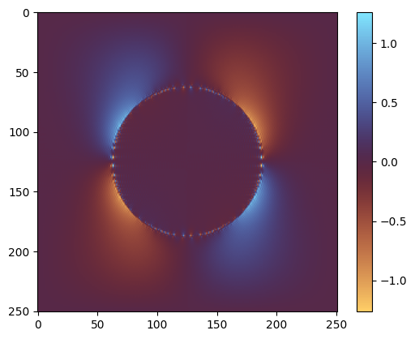

<div class="nb-header"><a href="https://colab.research.google.com/github/smec-ethz/xpektra/blob/main/notebooks/moulinec_suquet.ipynb" target="_blank"></a><a href="/assets/notebooks/moulinec_suquet.ipynb" download="moulinec_suquet.ipynb" class="nb-download-btn"><svg class="nb-download-icon" viewBox="0 0 24 24" xmlns="http://www.w3.org/2000/svg"><path d="M12 16l-6-6 1.41-1.41L11 13.17V4h2v9.17l3.59-3.58L18 11l-6 6z"/><path d="M5 18h14v2H5z"/></svg> Download</a></div>

# Fixed-point iteration

In this tutorial, we will solve the homogenization problem using Moulinec-Suquet's fixed-point iteration scheme.


```python
import jax

jax.config.update("jax_enable_x64", True)  # use double-precision

from functools import partial

import jax.numpy as jnp
import matplotlib.pyplot as plt
import numpy as np
from jax import Array

from xpektra import (
    MoulinecSuquetProjection,
    SpectralSpace,
    make_field,
)
from xpektra.scheme import FourierScheme
from xpektra.spectral_operator import SpectralOperator
from xpektra.transform import FFTTransform
```

Let us start by defining the RVE geometry. We will consider a 2D square RVE with a circular inclusion.


```python
N = 251
ndim = 2
length = 1
```


```python
# Create phase indicator (cylinder)
x = np.linspace(-0.5, 0.5, N)

if ndim == 3:
    Y, X, Z = np.meshgrid(x, x, x, indexing="ij")  # (N, N, N) grid
    phase = jnp.where(X**2 + Z**2 <= (0.2 / np.pi), 1.0, 0.0)  # 20% vol frac
else:
    X, Y = np.meshgrid(x, x, indexing="ij")  # (N, N) grid
    phase = jnp.where(X**2 + Y**2 <= (0.2 / np.pi), 1.0, 0.0)
```

## Define the material parameters

We consider a two-phase material with the following material parameters:

The first Lamé parameter is $\lambda_1 = 10.0$ and the second is $\lambda_2 = 100.0$ and shear moduli are $\mu_1 = 0.25, \mu_2 = 2.5$


```python
# Material parameters [grids of scalars, shape (N,N,N)]
lambda1, lambda2 = 10.0, 100.0
mu1, mu2 = 0.25, 2.5
lambdas = lambda1 * (1.0 - phase) + lambda2 * phase
mu = mu1 * (1.0 - phase) + mu2 * phase
```


```python
i = jnp.eye(ndim)
I = make_field(dim=ndim, shape=(N, N), rank=2) + i  # Add i to broadcast

I4 = jnp.einsum("il,jk->ijkl", i, i)
I4rt = jnp.einsum("ik,jl->ijkl", i, i)
I4s = (I4 + I4rt) / 2.0
II = jnp.einsum("...ij,...kl->...ijkl", I, I)

# Broadcast scalars to the 4th-order tensor shape
C4 = (
    lambdas[..., None, None, None, None] * II
    + (2.0 * mu[..., None, None, None, None]) * I4s
)

# Use average properties for the reference material
lambda0 = (lambda1 + lambda2) / 2.0
mu0 = (mu1 + mu2) / 2.0

# Build the constant C0 reference tensor [shape (3,3,3,3)]
C0 = lambda0 * II + 2.0 * mu0 * I4s
```


```python
fft_transform = FFTTransform(dim=ndim)
space = SpectralSpace(lengths=(length, length), shape=(N, N), transform=fft_transform)

diff_scheme = FourierScheme(space=space)

op = SpectralOperator(
    scheme=diff_scheme,
    space=space,
    projection=MoulinecSuquetProjection(lambda0=lambda0, mu0=mu0),
)
```


```python
@partial(jax.jit, static_argnames=["max_iter", "tol"])
def fixed_point_iteration(
    E_macro: Array, eps_guess: Array, max_iter: int, tol: float
) -> Array:
    """Solves the Lippmann-Schwinger equation via fixed-point iteration."""

    eps = eps_guess

    def cond_fun(state):
        eps_k, eps_prev, k = state
        err = jnp.linalg.norm(eps_k - eps_prev) / jnp.linalg.norm(E_macro)
        jax.debug.print("Error: {err}", err=err)
        return jnp.logical_and(err > tol, k < max_iter)

    def body_fun(state):
        eps_k, _, k = state

        # Calculate stress and polarization
        sigma = op.ddot(C4, eps_k)
        sigma0 = op.ddot(C0, eps_k)
        tau = sigma - sigma0  # Polarization field tau = σ - C0:ε

        # Apply Green's operator: ε_fluc = G^0 * tau
        tau_hat = op.forward(tau)
        eps_fluc_hat = op.project(tau_hat)
        eps_fluc = jnp.real(op.inverse(eps_fluc_hat))

        # Update total strain: ε_new = E_macro - ε_fluc
        eps_new = E_macro - eps_fluc

        return (eps_new, eps_k, k + 1)

    (eps_final, _, num_iters) = jax.lax.while_loop(
        cond_fun, body_fun, (eps, jnp.zeros_like(eps), 0)
    )

    # jax.debug.print("Converged in {i} iterations", i=num_iters)
    return eps_final
```


```python
# --- solve for load cases & homogenize ---
if ndim == 3:
    E_list = [
        jnp.array(
            [[1, 0, 0], [0, 0, 0], [0, 0, 0]],
        ),  # E_xx
        jnp.array(
            [[0, 0, 0], [0, 1, 0], [0, 0, 0]],
        ),  # E_yy
        jnp.array(
            [[0, 0, 0], [0, 0, 0], [0, 0, 1]],
        ),  # E_zz
        jnp.array(
            [[0, 1, 0], [1, 0, 0], [0, 0, 0]],
        ),  # 2E_xy
        jnp.array(
            [[0, 0, 0], [0, 0, 1], [0, 1, 0]],
        ),  # 2E_yz
        jnp.array(
            [[0, 0, 1], [1, 0, 0], [0, 0, 0]],
        ),  # 2E_xz
    ]

    homogenized_stiffness = jnp.zeros((6, 6))
    voigt_indices = [(0, 0), (1, 1), (2, 2), (0, 1), (1, 2), (0, 2)]

else:
    E_list = [
        jnp.array(
            [[1, 0], [0, 0]],
        ),  # E_xx
        jnp.array(
            [[0, 0], [0, 1]],
        ),  # E_yy
        jnp.array(
            [[0, 1], [1, 0]],
        ),  # 2E_xy
    ]

    homogenized_stiffness = jnp.zeros((2, 2))
    voigt_indices = [(0, 0), (1, 1), (0, 1)]


print("Starting homogenization...")
for i, E_voigt in enumerate(E_list):
    # Create the full E_macro field (broadcasts E_voigt)
    E_macro = make_field(dim=ndim, shape=(N, N), rank=2) + E_voigt

    # Solve the RVE problem
    eps_final = fixed_point_iteration(
        E_macro, eps_guess=E_macro, max_iter=200, tol=1e-8
    )

    # Compute the final stress field
    sig_final = op.ddot(C4, eps_final)

    # Homogenize (average over the volume)
    if ndim == 3:
        avg_stress = jnp.mean(sig_final, axis=(0, 1, 2))
    else:
        avg_stress = jnp.mean(sig_final, axis=(0, 1))

    # Store in Voigt notation
    for j, (row, col) in enumerate(voigt_indices):
        homogenized_stiffness = homogenized_stiffness.at[j, i].set(avg_stress[row, col])

print("Homogenized Stiffness (Voigt): \n", homogenized_stiffness)


plt.imshow(sig_final.at[:, :, 0, 0].get(), cmap="managua")
plt.colorbar()
plt.show()
```

    Starting homogenization...
    Error: 1.0
    Error: 0.6935031302765594
    Error: 0.3103770106405334
    Error: 0.14122247521171297
    Error: 0.06533922903456445
    Error: 0.030786000216867407
    Error: 0.015066600272192029
    Error: 0.00792539496671916
    Error: 0.004684895298773023
    Error: 0.0031299500540455244
    Error: 0.002277436688405015
    Error: 0.0017315062118714007
    Error: 0.0013418840557507692
    Error: 0.0010498324247963464
    Error: 0.0008248874032332835
    Error: 0.0006504702360824441
    Error: 0.0005139244311458543
    Error: 0.000407041758329968
    Error: 0.0003228308437711801
    Error: 0.00025656451397461334
    Error: 0.00020412611882427887
    Error: 0.00016269392059947013
    Error: 0.0001297906933737519
    Error: 0.00010370503248918223
    Error: 8.292625774009405e-05
    Error: 6.640458782032647e-05
    Error: 5.320931960125312e-05
    Error: 4.2690544794933e-05
    Error: 3.427006097834183e-05
    Error: 2.754233639942546e-05
    Error: 2.2145605171604346e-05
    Error: 1.7825076002272905e-05
    Error: 1.435300320243211e-05
    Error: 1.1568326017600169e-05
    Error: 9.326888270948043e-06
    Error: 7.526324186483838e-06
    Error: 6.07494446174148e-06
    Error: 4.907371244007024e-06
    Error: 3.965033194031198e-06
    Error: 3.2059935944095537e-06
    Error: 2.592691372563256e-06
    Error: 2.098121518259586e-06
    Error: 1.698112547180605e-06
    Error: 1.3752143853155828e-06
    Error: 1.1138234233210102e-06
    Error: 9.02629014712068e-07
    Error: 7.315301925525317e-07
    Error: 5.931756355869575e-07
    Error: 4.810100663755175e-07
    Error: 3.9024390703505294e-07
    Error: 3.1661335837505987e-07
    Error: 2.569911642211907e-07
    Error: 2.0859838368409955e-07
    Error: 1.6938924148046756e-07
    Error: 1.3754927064010818e-07
    Error: 1.1173790962527595e-07
    Error: 9.076849870248438e-08
    Error: 7.376127212898336e-08
    Error: 5.993901730424165e-08
    Error: 4.87236036965951e-08
    Error: 3.9605316900990294e-08
    Error: 3.220379315118077e-08
    Error: 2.6184351116830385e-08
    Error: 2.1296477664837015e-08
    Error: 1.732018237424785e-08
    Error: 1.4090318361334832e-08
    Error: 1.1462141904618898e-08
    Error: 9.32669085446741e-09
    Error: 1.0
    Error: 0.6935031302765594
    Error: 0.31037701064053336
    Error: 0.14122247521171286
    Error: 0.0653392290345642
    Error: 0.030786000216867414
    Error: 0.01506660027219208
    Error: 0.007925394966719143
    Error: 0.004684895298772996
    Error: 0.00312995005404544
    Error: 0.0022774366884048946
    Error: 0.0017315062118712803
    Error: 0.0013418840557506684
    Error: 0.0010498324247962625
    Error: 0.0008248874032331897
    Error: 0.000650470236082357
    Error: 0.0005139244311457765
    Error: 0.00040704175832992654
    Error: 0.00032283084377118126
    Error: 0.0002565645139746209
    Error: 0.00020412611882427933
    Error: 0.00016269392059946823
    Error: 0.00012979069337374925
    Error: 0.00010370503248916076
    Error: 8.292625774006554e-05
    Error: 6.640458782027611e-05
    Error: 5.32093196011756e-05
    Error: 4.269054479485732e-05
    Error: 3.427006097827245e-05
    Error: 2.7542336399358607e-05
    Error: 2.214560517156083e-05
    Error: 1.7825076002236923e-05
    Error: 1.4353003202394185e-05
    Error: 1.1568326017584977e-05
    Error: 9.32688827093571e-06
    Error: 7.526324186453697e-06
    Error: 6.0749444617153865e-06
    Error: 4.907371243989694e-06
    Error: 3.965033194018279e-06
    Error: 3.205993594380372e-06
    Error: 2.5926913725276158e-06
    Error: 2.0981215182092944e-06
    Error: 1.698112547146453e-06
    Error: 1.375214385298593e-06
    Error: 1.1138234233181492e-06
    Error: 9.026290147219088e-07
    Error: 7.315301925301596e-07
    Error: 5.931756355526913e-07
    Error: 4.810100663784345e-07
    Error: 3.902439070766536e-07
    Error: 3.1661335841661996e-07
    Error: 2.569911642407797e-07
    Error: 2.0859838370121595e-07
    Error: 1.6938924148361291e-07
    Error: 1.3754927063089193e-07
    Error: 1.1173790961783615e-07
    Error: 9.07684986978607e-08
    Error: 7.376127212069506e-08
    Error: 5.993901729644183e-08
    Error: 4.8723603698134755e-08
    Error: 3.960531688153151e-08
    Error: 3.2203793111844174e-08
    Error: 2.6184351079556184e-08
    Error: 2.129647767407521e-08
    Error: 1.7320182430818884e-08
    Error: 1.4090318462841898e-08
    Error: 1.1462142037886911e-08
    Error: 9.326690977475919e-09
    Error: 1.0
    Error: 0.5266718859695122
    Error: 0.0349673206121437
    Error: 0.010961719238350667
    Error: 0.006471143050372437
    Error: 0.004230327905581393
    Error: 0.002941118560935299
    Error: 0.002131643836046506
    Error: 0.0015928545782293196
    Error: 0.0012132402466736476
    Error: 0.0009377709852979468
    Error: 0.0007312724469387376
    Error: 0.0005745015733640879
    Error: 0.00045334515374911166
    Error: 0.00035922928188704113
    Error: 0.00028536294469459647
    Error: 0.0002272687837220055
    Error: 0.00018128426421254915
    Error: 0.00014485497155787135
    Error: 0.00011587019947719534
    Error: 9.280139200293281e-05
    Error: 7.438416369970654e-05
    Error: 5.967905250863202e-05
    Error: 4.7910600741528165e-05
    Error: 3.849211623653773e-05
    Error: 3.09407480463925e-05
    Error: 2.4886349460043065e-05
    Error: 2.0025149881239583e-05
    Error: 1.612199185386992e-05
    Error: 1.2984346310743811e-05
    Error: 1.0462063451571944e-05
    Error: 8.432435218212186e-06
    Error: 6.799223681439116e-06
    Error: 5.483877367404888e-06
    Error: 4.424526487758379e-06
    Error: 3.5707072929509048e-06
    Error: 2.882546174792068e-06
    Error: 2.327527832380616e-06
    Error: 1.879901039326172e-06
    Error: 1.5186627437189383e-06
    Error: 1.2271523750398519e-06
    Error: 9.917739791870485e-07
    Error: 8.017315235547645e-07
    Error: 6.48207496397955e-07
    Error: 5.241963284999641e-07
    Error: 4.239701922625426e-07
    Error: 3.429774858518625e-07
    Error: 2.774920913207678e-07
    Error: 2.2455344897352704e-07
    Error: 1.8173453259045253e-07
    Error: 1.4710769627481844e-07
    Error: 1.190902980865383e-07
    Error: 9.642605911865163e-08
    Error: 7.808191082908235e-08
    Error: 6.323841367319836e-08
    Error: 5.122062139665694e-08
    Error: 4.1493611631776986e-08
    Error: 3.3616053418117805e-08
    Error: 2.7238499060655853e-08
    Error: 2.207215890110293e-08
    Error: 1.788859466936171e-08
    Error: 1.449870600040102e-08
    Error: 1.1753065157944821e-08
    Error: 9.52777196957291e-09
    Homogenized Stiffness (Voigt): 
     [[12.9037581  12.15660601]
     [12.15660601 12.9037581 ]]


    

    


```python

```
