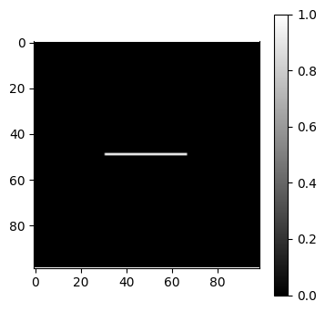
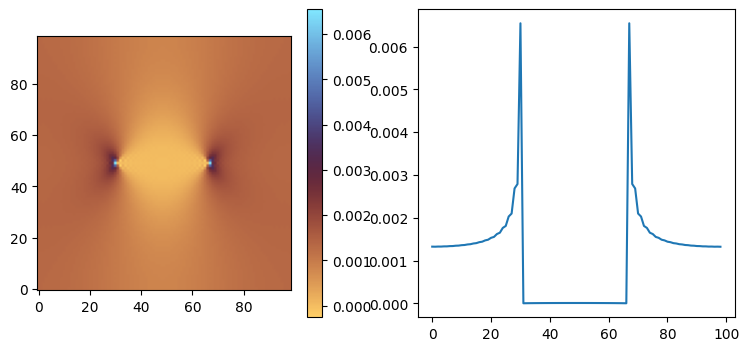
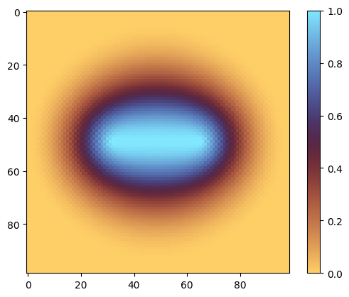
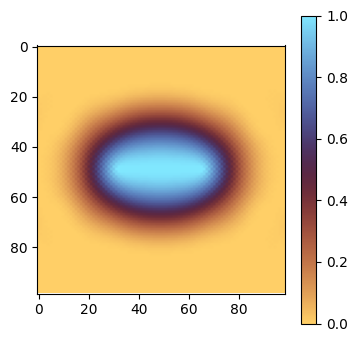
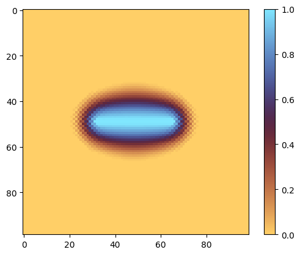
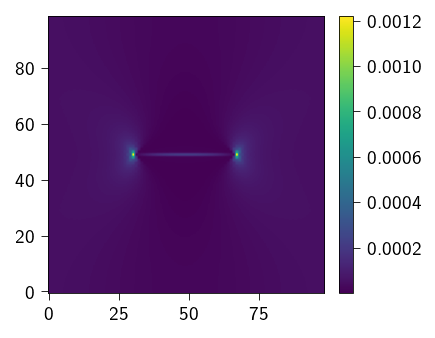
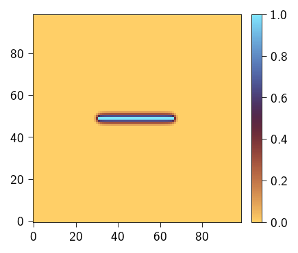
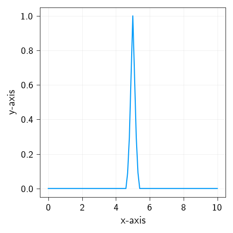
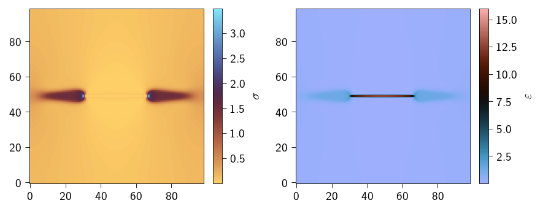

<div class="nb-header"><a href="https://colab.research.google.com/github/smec-ethz/xpektra/blob/main/notebooks/phasefield_fracture_2D.ipynb" target="_blank"></a><a href="/assets/notebooks/phasefield_fracture_2D.ipynb" download="phasefield_fracture_2D.ipynb" class="nb-download-btn"><svg class="nb-download-icon" viewBox="0 0 24 24" xmlns="http://www.w3.org/2000/svg"><path d="M12 16l-6-6 1.41-1.41L11 13.17V4h2v9.17l3.59-3.58L18 11l-6 6z"/><path d="M5 18h14v2H5z"/></svg> Download</a></div>

```python
import jax
jax.config.update("jax_enable_x64", True)  # use double-precision
jax.config.update("jax_persistent_cache_min_compile_time_secs", 0)
jax.config.update("jax_platforms", "cpu")
import jax.numpy as jnp

import numpy as np
import equinox as eqx
import matplotlib.pyplot as plt
from skimage.morphology import footprint_rectangle
```


```python
from xpektra import SpectralSpace, make_field
from xpektra.transform import FFTTransform
from xpektra.spectral_operator import SpectralOperator
from xpektra.scheme import FourierScheme, RotatedDifference
from xpektra.projection_operator import GalerkinProjection


from xpektra.solvers.nonlinear import newton_krylov_solver, conjugate_gradient_while
```


```python
N = 99
ndim = 2
length = 10
dx = length / N
ell = 0.2
```


```python
def create_structure(N):
    Hmid = int(N / 2)
    Lmid = int(N / 2)
    r = int(N / 10)

    structure = np.zeros((N, N))
    structure[Hmid : Hmid + 1, Lmid - 2 * r : Lmid + 2 * r] += footprint_rectangle(
        (1, 4 * r)
    )

    return structure


structure = create_structure(N)
plt.figure(figsize=(4, 4))
cb = plt.imshow(structure, cmap="gray")
plt.colorbar(cb)
plt.show()
```


    

    


Spatial and FFT operators that we need for solving of frature problem. 


```python
fft_transform = FFTTransform(ndim)
space = SpectralSpace(shape=(N, N), lengths=(length, length), transform=fft_transform)
diff_scheme = RotatedDifference(space=space)
op = SpectralOperator(scheme=diff_scheme, space=space)
```

The total energy of the material undergoing fracture can be given as 

\begin{align}
\psi(\varepsilon_{ij}) &= \psi_{elastic} + \psi_{fracture} \\
\psi &= g(\alpha)\psi_{e}^{+} + \psi_{e}^{-} + \dfrac{G_{c}}{c_w}(\dfrac{w(\alpha)}{l} + l|\nabla\alpha|^{2})
\end{align}


Defining the elastic strain energy with degradation of only `positive` energy part, we use the `volumetric-deviatoric` split to define the positive and negative part.


### Elasticity subproblem

Now, we divided the problem into two subproblems: elastic and fracture. taking the first variation of functional $\psi$ with respect to $\varepsilon$ and $\alpha$. The first  variation of functional $F[u]$ is defined as :

\begin{align}
\delta F[u] &= \lim_{\epsilon\to 0} \dfrac{F[u+\epsilon\delta u] - F[u]}{\epsilon} = \lim_{\epsilon\to0} \dfrac{\text{d}}{\text{d}\epsilon} I[u+\epsilon\delta u]
\end{align}
The above is also called Gateaux derivative. 

For functional form that may involve $u$ as well as  its partial derivatives, we can define the first variation as follows:

\begin{align}
I[u] &= \int f(u, \nabla u, ...) dV \to \delta I[u] = \int \big( \dfrac{\partial f}{\partial u_i}\delta u_{i} + \dfrac{\partial f}{\partial u_{i,j}}\delta u_{i, j} + ....\big) dV 
\end{align}

The first variation of $\psi$ with respect to $\varepsilon$

\begin{align}
\delta \psi(\varepsilon) &= \int \dfrac{\partial \psi}{\partial \varepsilon}\delta\varepsilon dV \\
&= \int \underbrace{\Big(g(\alpha) \dfrac{\partial \psi_e^{+}}{\partial \varepsilon} + \dfrac{\partial \psi_{e}^{-}}{\partial \varepsilon}\Big)}_{\sigma}\delta \varepsilon dV
\end{align} 

For this subproblem,we solve the weak form given as 

$$\delta \psi(\epsilon) = \int \sigma \delta \epsilon dV = 0$$

and we use  the Fourier-Galerkin method for that. 

For FFT scheme, we define the above strain expression for each grid point ($x,y$)

$$\psi_{xy} = \dfrac{1}{2}(\text{tr}(\varepsilon_{iixy})^2 + \mu \text{tr}(\varepsilon_{ijxy}\varepsilon_{jkxy} ) $$
$$\sigma_{ijxy} = \dfrac{\partial \psi_{xy}}{\partial \varepsilon_{ijxy}}$$


```python
E_solid = 1.
E_void = 1e-3
nu = 0.3

Gc = 1e-2
lambda_solid = E_solid * nu / ((1 + nu) * (1 - 2 * nu))
lambda_void = E_void * nu / ((1 + nu) * (1 - 2 * nu))
mu_solid = E_solid / (2 * (1 + nu))
mu_void = E_void / (2 * (1 + nu))

lambda_field = lambda_solid * (1-structure) + lambda_void * structure
mu_field = mu_solid * (1-structure) + mu_void * structure
bulk_field = lambda_field + 2 * mu_field / 3


elasticity_dofs_shape = make_field(dim=ndim, shape=(N, N), rank=2).shape
fracture_dofs_shape = make_field(dim=ndim, shape=(N, N), rank=0).shape
```


```python
i = jnp.eye(ndim)
I = make_field(dim=ndim, shape=(N, N), rank=2) + i

cw = 2 / 3.0
kappa = 1e-1


@jax.jit
def g(alpha):
    return (1 - alpha) ** 2 + kappa


@jax.jit
def w(alpha):
    return alpha  # 0.5*alpha**2 # alpha


@jax.jit
def no_split(eps):
    eps_sym = 0.5 * (eps + op.trans(eps))
    energy = 0.5 * jnp.multiply(lambda_field, op.trace(eps_sym) ** 2) + jnp.multiply(
        mu_field, op.trace(op.dot(eps_sym, eps_sym))
    )
    return energy


@jax.jit
def vol_dev_split(eps):
    def macluay_plus(A):
        return 0.5 * (A + jnp.abs(A))

    def macluay_minus(A):
        return 0.5 * (A - jnp.abs(A))

    esp_plus = macluay_plus(op.trace(eps))
    esp_minus = macluay_minus(op.trace(eps))
    eps_dev = (
        eps - jnp.einsum("ij, ...->...ij", jnp.eye(ndim), op.trace(eps)) / 3
    )  # deviatoric strain

    strain_energy_plus = 0.5 * jnp.multiply(
        bulk_field, jnp.multiply(esp_plus, esp_plus)
    ) + jnp.multiply(mu_field, op.ddot(eps_dev, eps_dev))
    strain_energy_minus = 0.5 * jnp.multiply(
        mu_field, jnp.multiply(esp_minus, esp_minus)
    )

    return strain_energy_plus, strain_energy_minus


@jax.jit
def spectral_split(eps):
    def macluay_plus(A):
        return 0.5 * (A + jnp.abs(A))

    def macluay_minus(A):
        return 0.5 * (A - jnp.abs(A))

    eps_eg = jnp.linalg.eig(eps)


@jax.jit
def strain_energy(eps_flat, alpha_flat):
    eps = eps_flat.reshape(elasticity_dofs_shape)
    alpha = alpha_flat.reshape(fracture_dofs_shape)
    eps_sym = 0.5 * (eps + op.trans(eps))
    strain_energy_plus, strain_energy_minus = vol_dev_split(eps_sym)
    energy = g(alpha) * strain_energy_plus + strain_energy_minus
    # strain_energy = no_split(eps_sym)
    # energy = g(alpha)*strain_energy
    return energy.sum()


compute_stress = jax.jacrev(strain_energy)
```


```python
Ghat = GalerkinProjection(scheme=diff_scheme)
```


```python
from jax import Array

class ElasticityResidual(eqx.Module):
    """A callable module that computes the residual vector."""

    dofs_shape: tuple = eqx.field(static=True)
 
    # We can even pre-define the stress function if it's always the same
    # For this example, we'll keep your original `compute_stress` function
    # available in the global scope.

    @eqx.filter_jit
    def __call__(self, eps_flat: Array, alpha_flat: Array) -> Array:
        """
        This makes instances of this class behave like a function.
        It takes only the flattened vector of unknowns, as required by the solver.
        """
        eps_flat = eps_flat.reshape(-1)
        alpha_flat = alpha_flat.reshape(-1)
        sigma = compute_stress(eps_flat, alpha_flat)
        residual_field = op.inverse(
            Ghat.project(op.forward(sigma.reshape(self.dofs_shape)))
        )
        return jnp.real(residual_field).reshape(-1)


class ElasticityJacobian(eqx.Module):
    """A callable module that represents the Jacobian operator (tangent)."""

    dofs_shape: tuple = eqx.field(static=True)

    @eqx.filter_jit
    def __call__(self, deps_flat: Array, alpha_flat: Array) -> Array:
        """
        The Jacobian is a linear operator, so its __call__ method
        represents the Jacobian-vector product.
        """

        deps_flat = deps_flat.reshape(-1)
        alpha_flat = alpha_flat.reshape(-1)
        dsigma = compute_stress(deps_flat, alpha_flat)
        jvp_field = op.inverse(
            Ghat.project(op.forward(dsigma.reshape(self.dofs_shape)))
        )
        return jnp.real(jvp_field).reshape(-1)
```


```python
alpha0    = structure 

applied_strains = jnp.diff(jnp.linspace(0, 1e-3, num=2))

deps = make_field(dim=ndim, shape=structure.shape, rank=2)
eps = make_field(dim=ndim, shape=structure.shape, rank=2)

residual_fn = ElasticityResidual(dofs_shape=eps.shape)
jacobian_fn = ElasticityJacobian(dofs_shape=eps.shape)


for inc, deps_avg in enumerate(applied_strains):
 
    # solving for elasticity
    deps[:, :, 0, 0] = deps_avg

    b = -jacobian_fn(deps.reshape(-1), alpha_flat=alpha0.reshape(-1))
    eps = eps + deps


    residual_partial = eqx.Partial(residual_fn, alpha_flat=alpha0.reshape(-1))
    jacobian_partial = eqx.Partial(jacobian_fn, alpha_flat=alpha0.reshape(-1))

    final_state = newton_krylov_solver(
        state=(deps, b, eps),
        gradient=residual_partial,
        jacobian=jacobian_partial,
        tol=1e-8,
        max_iter=20,
        krylov_solver=conjugate_gradient_while,
        krylov_tol=1e-8,
        krylov_max_iter=50,
    )
    eps = final_state[2]

eps = final_state[2].reshape(elasticity_dofs_shape)
sig = compute_stress(final_state[2], alpha_flat=alpha0.reshape(-1)).reshape(elasticity_dofs_shape)

```

    CG error = 0.00006655978748


    CG error = 0.00042089973622
    CG error = 0.00007554364467
    CG error = 0.00001522675664
    CG error = 0.00000352423017
    CG error = 0.00000077934000
    CG error = 0.00000017491980
    CG error = 0.00000003847124
    CG error = 0.00000000975842
    CG error = 0.00000000225270
    CG error = 0.00000000055261
    CG error = 0.00000000012713
    CG error = 0.00000000003065
    CG error = 0.00000000000702
    CG error = 0.00000000000166
    CG error = 0.00000000000038
    CG error = 0.00000000000009
    CG error = 0.00000000000002
    CG error = 0.00000000000000
    CG error = 0.00000000000000
    Didnot converge, Residual value : 2.3441717668617714e-08


```python
fig, (ax1, ax2) = plt.subplots(1, 2, figsize=(9, 4))
cb = ax1.imshow(sig.at[:, :, 0, 0].get(), cmap="managua", origin='lower')
fig.colorbar(cb, ax=ax1)

ax2.plot(sig.at[:, :, 0, 0].get()[N//2, :])
plt.show()
```


    

    


```python
op.grad(alpha0).shape
```


    (99, 99, 2)


## phasefield subproblem

The first variation of $\psi$ with respect to $\alpha$ 

\begin{align}
\delta \psi(\alpha) &= \int \big( \dfrac{\partial \psi}{\partial \alpha}\delta \alpha + \dfrac{\partial \psi}{\partial \nabla \alpha}\delta \nabla \alpha \big) dV \\
&= \int \Big ( \psi_{e}^{+}\dfrac{\partial g(\alpha)}{\partial \alpha}\delta \alpha + \dfrac{G_{c}}{c_w}\dfrac{1}{l}\dfrac{\partial w(\alpha)}{\partial \alpha}\delta \alpha + 2\dfrac{G_{c}}{c_w}\nabla\alpha \delta\nabla \alpha\Big) dV
\end{align}

We can apply intergation by parts to the last term

$$ \int \nabla \alpha \delta \nabla \alpha dV =  \nabla \alpha \delta \alpha |_{\Gamma} - \int \nabla ( \nabla \alpha ) \delta \alpha~ dV  $$

and since $\delta \alpha=0$ at the boundaries we can say that the first variation of $\psi$ w.r.t $\alpha$

$$ \delta \psi(\alpha) =  \int \Big ( \psi_{e}^{+}\dfrac{\partial g(\alpha)}{\partial \alpha} + \dfrac{G_{c}}{c_w}\dfrac{1}{l}\dfrac{\partial w(\alpha)}{\partial \alpha} - 2\ell\dfrac{G_{c}}{c_w}\nabla \cdot{} \nabla \alpha  \Big) \delta \alpha dV = 0$$

For this subproblem we chose to solve the strong form rather than the above weak form. The strong form is given from the above weak form. Since the above equation holds for any $\delta \alpha$ therefore, we can say 

$$ \psi_{e}^{+}\dfrac{\partial g(\alpha)}{\partial \alpha} + \dfrac{G_{c}}{c_w}\dfrac{1}{l}\dfrac{\partial w(\alpha)}{\partial \alpha} - 2\ell \dfrac{G_{c}}{c_w}\nabla \cdot{} \nabla \alpha = 0 $$


We use `AT1` phasefield formulation for the phasefield degradation function. 


```python
@jax.jit
def g_sum(alpha):
    return g(alpha).sum()


@jax.jit
def w_sum(alpha):
    return w(alpha).sum()


dgdalpha = jax.jit(jax.grad(g_sum))
dwdalpha = jax.jit(jax.grad(w_sum))


@jax.jit
def fracture_energy(alpha_flat, eps_flat):
    eps = eps_flat.reshape(elasticity_dofs_shape)
    alpha = alpha_flat.reshape(fracture_dofs_shape)
    eps_sym = 0.5 * (eps + op.trans(eps))
    strain_energy_plus, _ = vol_dev_split(eps_sym)
    elastic_energy = g(alpha) * strain_energy_plus

    energy = (
        elastic_energy
        + jnp.multiply(Gc, w(alpha)) / cw
        + jnp.multiply(
            Gc,
            ell * ell * jnp.einsum("...ij,...ij->...", op.grad(alpha), op.grad(alpha)),
        )
        / cw
    )
    # strain_energy = no_split(eps_sym)
    # energy = g(alpha)*strain_energy
    return energy.sum()


@jax.jit
def fracture_strong_form(alpha, epsilon):
    alpha = alpha.reshape((N, N))

    eps_sym = 0.5 * (epsilon + op.trans(epsilon))
    strain_energy_plus, _ = vol_dev_split(eps_sym)

    res = (
        jnp.multiply(strain_energy_plus, dgdalpha(alpha))
        + jnp.multiply(Gc, dwdalpha(alpha)) / ell / cw
        - 2 * ell * jnp.multiply(Gc, op.laplacian(alpha)) / cw
    )
    return res.reshape(-1)
```

The phasefield subproblem is a root-finding problem under cosntraints and is given as 

Find $\alpha $ for a given $\varepsilon$ such that
$$ \psi_{e}^{+}\dfrac{\partial g(\alpha)}{\partial \alpha} + \dfrac{G_{c}}{c_w}\dfrac{1}{l}\dfrac{\partial w(\alpha)}{\partial \alpha} - 2\ell\dfrac{G_{c}}{c_w}\nabla \cdot{} \nabla \alpha = 0 $$

and the constraint is $\alpha_\textsf{prev} < \alpha < 1 $ for irreversibility.


```python
fracture_energy(alpha0.reshape(-1), eps.reshape(-1))
```


    Array(419.71454456, dtype=float64)


```python
from scipy.optimize import minimize, Bounds
```


```python
@eqx.filter_jit
def least_squares_objective(alpha, F_func):
    """
    Computes the scalar objective: 1/2 * ||F(alpha)||^2
    
    Args:
        alpha: The input vector
        F_func: Your original function that returns the residual vector
    """
    residual_vector = F_func(alpha)
    return 0.5 * jnp.dot(residual_vector, residual_vector)

F = eqx.Partial(fracture_strong_form, epsilon=eps)

least_squares_objective_partial = eqx.Partial(least_squares_objective, F_func=F)

fracture_energy_partial = eqx.Partial(fracture_energy, eps_flat=eps.reshape(-1))
```


```python
from scipy.optimize import minimize, Bounds


# 2. Create the combined value-and-gradient function
#    This is the key to connecting JAX to SciPy.
#
#    NOTE: F_func is passed as a static argument because
#    it's a Python function, not a JAX array.
value_and_grad_jax = jax.jit(jax.value_and_grad(least_squares_objective_partial))


# 3. Create a wrapper for SciPy
#    SciPy solvers expect functions that:
#    - Accept a 1D NumPy float64 array.
#    - Return NumPy float64s.
#    This wrapper handles the type conversions.
def scipy_objective_and_grad(alpha_np):
    """
    Wrapper for SciPy to call our JIT-compiled JAX function.
    """
    # Convert NumPy input to JAX array
    alpha_jax = jnp.asarray(alpha_np)

    # Call the JAX function
    value_jax, grad_jax = value_and_grad_jax(alpha_jax)
    #value_jax = least_squares_objective_partial(alpha_jax)
    #grad_jax = F(alpha_jax)

    # Convert JAX outputs back to NumPy float64
    value_np = np.float64(value_jax)
    grad_np = np.array(grad_jax, dtype=np.float64)

    return value_np, grad_np


# SciPy L-BFGS-B works best with float64
# Ensure your initial guess is a flat NumPy array
alpha0_np = np.array(alpha0, dtype=np.float64).flatten()

# Create the SciPy Bounds object
scipy_bounds = Bounds(alpha0.reshape(-1), jnp.ones_like(alpha0).reshape(-1))

print("Starting scipy.optimize.minimize (L-BFGS-B) with JAX gradient...")

# Run the solver!
# - fun: The wrapper function
# - x0: Initial guess
# - args: Extra arguments to pass to our wrapper (F_func)
# - method: The solver that worked for you
# - jac=True: Tells SciPy that 'fun' returns (value, gradient)
# - bounds: The constraints
# - options: Set 'disp' to True for verbose output
result = minimize(
    fun=scipy_objective_and_grad,
    x0=alpha0_np,
    method="L-BFGS-B",
    jac=True,
    bounds=scipy_bounds,
    options={"disp": True, "maxiter": 500},
)

# --- 5. Check the results ---
print("\n--- SciPy Results ---")
print(f"Success: {result.success}")
print(f"Message: {result.message}")
print(f"Final objective (1/2 ||F||^2): {result.fun}")
final_F_norm = jnp.sqrt(2 * result.fun)
print(f"Final residual norm ||F||: {final_F_norm}")
print(F(result.x).reshape((N, N)))

# The final solution vector
final_alpha = result.x
```

    Starting scipy.optimize.minimize (L-BFGS-B) with JAX gradient...


    /tmp/ipykernel_5369/2471087639.py:53: DeprecationWarning: scipy.optimize: The `disp` and `iprint` options of the L-BFGS-B solver are deprecated and will be removed in SciPy 1.18.0.
      result = minimize(


    
    --- SciPy Results ---
    Success: True
    Message: CONVERGENCE: RELATIVE REDUCTION OF F <= FACTR*EPSMCH
    Final objective (1/2 ||F||^2): 27.516645377736474
    Final residual norm ||F||: 7.41844260983887
    [[0.0748839  0.07488408 0.07488441 ... 0.07488408 0.0748839  0.07488383]
     [0.07488384 0.07488405 0.07488435 ... 0.07488405 0.07488384 0.0748838 ]
     [0.07488377 0.07488393 0.07488428 ... 0.07488393 0.07488377 0.07488368]
     ...
     [0.07488377 0.07488393 0.07488428 ... 0.07488393 0.07488377 0.07488368]
     [0.07488384 0.07488405 0.07488435 ... 0.07488405 0.07488384 0.0748838 ]
     [0.0748839  0.07488408 0.07488441 ... 0.07488408 0.0748839  0.07488383]]


```python
plt.imshow(final_alpha.reshape((N, N)), cmap="managua")
plt.colorbar()
plt.show()
```


    

    


## using jaxopt


```python
from jaxopt import ProjectedGradient
from jaxopt import ScipyBoundedMinimize # <-- Alternative, see below
from jaxopt.projection import projection_box
```


```python
# We need a new function that returns a scalar to be *minimized*.
# The standard choice is the sum of squares of the residual.

@eqx.filter_jit
def least_squares_objective(alpha, F_func):
    """
    Computes the scalar objective: 1/2 * ||F(alpha)||^2
    
    Args:
        alpha: The input vector
        F_func: Your original function that returns the residual vector
    """
    residual_vector = F_func(alpha)
    return 0.5 * jnp.dot(residual_vector, residual_vector)
```


```python
# --- Create the bounds tuple ---
bounds = (structure.reshape(-1), jnp.ones(N*N))

least_squares_objective_partial = eqx.Partial(least_squares_objective, F_func=F)
```


```python
lbfgsb = ScipyBoundedMinimize(
    fun=least_squares_objective_partial,
    method="L-BFGS-B",
    maxiter=500,
    tol=1e-6,
    options={'disp': True} # Show SciPy's output
)

# 'sol' will contain the final 'alpha' and solver state
sol_scipy, state_scipy = lbfgsb.run(
    init_params=alpha0.reshape(-1),
    bounds=bounds,
)

print(state_scipy.success)
```

    True


```python
plt.figure(figsize=(4, 4))
cb = plt.imshow(sol_scipy.reshape((N, N)), cmap="managua")
plt.colorbar(cb)
plt.show()
```


    

    


```python
import jax.scipy.sparse.linalg as jsl


def projected_gauss_newton(
    F,                  # function F(alpha) -> residual vector (jax array)
    alpha0,             # initial guess (full-sized vector)
    lb,                 # lower bound (full-sized vector)
    ub,                 # upper bound (full-sized vector)
    max_iter=200,
    tol=1e-10,
    solver_tol=1e-8,    # Tolerance for the CG solver
    solver_maxiter=None # Max iterations for the CG solver
):
    """
    Solve F(alpha) = 0 subject to lb <= alpha <= ub using a
    projected Gauss-Newton method (matching PETSc's KSP 'cg').
    
    This solves the normal equations (J^T J) * delta = -J^T F
    in the projected free space.
    """

    if solver_maxiter is None:
        solver_maxiter = alpha0.size

    # Jacobian-vector product: Jv(v) = J(alpha) @ v
    def Jv_full(v, alpha):
        return jax.jvp(F, (alpha,), (v,))[1]

    # Vector-Jacobian product (transpose): vJ(v) = v^T @ J(alpha)
    def vJ_full(v, alpha):
        # jax.vjp returns (primals_out, vjp_fun)
        _, vjp_fun = jax.vjp(F, alpha)
        # vjp_fun(v) returns a tuple of gradients; we want the one for alpha
        return vjp_fun(v)[0]

    alpha = alpha0

    for it in range(max_iter):
        res = F(alpha)
        fnorm = jnp.linalg.norm(res)

        print(f"Iter {it}, ||F||={fnorm}")

        if fnorm < tol:
            return alpha

        # Identify active set
        eps_proj = 1e-12
        at_lb = (alpha <= lb + eps_proj)
        at_ub = (alpha >= ub - eps_proj)
        active = at_lb | at_ub

        n_free = alpha.size - int(jnp.sum(active))
        if n_free == 0:
            print("All variables are active; no further progress can be made.")
            return alpha

        # --- Define the full-space projected Gauss-Newton operator ---
        # This operator A(v) computes (P_F @ J^T @ J @ P_F) @ v
        def projected_JTJ_v(v):
            # 1. Project input: v_in = P_F @ v
            v_in = jnp.where(active, 0.0, v)
            
            # 2. Apply J: Jv = J @ v_in
            Jv = Jv_full(v_in, alpha)
            
            # 3. Apply J^T: JTJv = J^T @ Jv
            # We don't need to project Jv because J^T will only
            # produce output in the free-space anyway (conceptually).
            JTJv = vJ_full(Jv, alpha)

            # 4. Project output: v_out = P_F @ JTJv
            v_out = jnp.where(active, 0.0, JTJv)
            
            return v_out

        # --- Define the full-space projected right-hand side ---
        # This is b = -P_F @ (J^T F)
        JT_F = vJ_full(res, alpha)
        r_full = jnp.where(active, 0.0, -JT_F)

        # --- Solve the (symmetric) projected system using CG ---
        delta, exit_code = jsl.cg(
            projected_JTJ_v, 
            r_full, 
            tol=solver_tol, 
            maxiter=solver_maxiter
        )
        
        if exit_code != 0:
            print(f"Warning: CG solver did not converge. Exit code: {exit_code}")

        # --- TODO: ADD A LINE SEARCH HERE ---

        step = 1.0
        fnorm_old_sq = fnorm**2
        for _ in range(50): # Max 10 line search steps
            alpha_new = jnp.clip(alpha + step * delta, lb, ub)
            res_new = F(alpha_new)
            fnorm_new_sq = jnp.linalg.norm(res_new)**2
    
            # Armijo condition (sufficient decrease)
            if fnorm_new_sq < fnorm_old_sq: # (simplified version)
                alpha = alpha_new
                break
    
            step /= 2.0 # Decrease step size
        else:
            # Line search failed
            print("Line search failed to find a better point.")
            return alpha
    raise RuntimeError("Projected Gauss-Newton failed to converge within max_iter")
```


```python
def projected_levenberg_marquardt(
    F,                  # function F(alpha) -> residual vector (jax array)
    alpha0,             # initial guess (full-sized vector)
    lb,                 # lower bound (full-sized vector)
    ub,                 # upper bound (full-sized vector)
    max_iter=200,
    tol=1e-10,
    solver_tol=1e-8,    # Tolerance for the CG solver
    solver_maxiter=None,
    damping=1e-4        # Damping parameter (lambda)
):
    """
    Solve F(alpha) = 0 subject to lb <= alpha <= ub using a
    projected Levenberg-Marquardt method.
    
    This solves the damped normal equations
    (J^T J + damping*I) * delta = -J^T F
    in the projected free space.
    """

    if solver_maxiter is None:
        solver_maxiter = alpha0.size

    # Jacobian-vector product: Jv(v) = J(alpha) @ v
    def Jv_full(v, alpha):
        return jax.jvp(F, (alpha,), (v,))[1]

    # Vector-Jacobian product (transpose): vJ(v) = v^T @ J(alpha)
    def vJ_full(v, alpha):
        _, vjp_fun = jax.vjp(F, alpha)
        return vjp_fun(v)[0]

    alpha = alpha0

    for it in range(max_iter):
        res = F(alpha)
        fnorm = jnp.linalg.norm(res)

        print(f"Iter {it}, ||F||={fnorm}")

        if fnorm < tol:
            return alpha

        # Identify active set
        eps_proj = 1e-12
        at_lb = (alpha <= lb + eps_proj)
        at_ub = (alpha >= ub - eps_proj)
        active = at_lb | at_ub

        n_free = alpha.size - int(jnp.sum(active))
        if n_free == 0:
            print("All variables are active; no further progress can be made.")
            return alpha

        # --- Define the full-space projected Levenberg-Marquardt operator ---
        # This operator A(v) computes (P_F @ J^T @ J @ P_F + damping * P_F) @ v
        def projected_LM_v(v):
            # 1. Project input: v_in = P_F @ v
            v_in = jnp.where(active, 0.0, v)
            
            # 2. Apply J: Jv = J @ v_in
            Jv = Jv_full(v_in, alpha)
            
            # 3. Apply J^T: JTJv = J^T @ Jv
            JTJv = vJ_full(Jv, alpha)

            # 4. Project output and add damping term
            # v_out = (P_F @ JTJv) + (damping * v_in)
            v_out_jtj = jnp.where(active, 0.0, JTJv)
            v_out = v_out_jtj + damping * v_in
            
            return v_out

        # --- Define the full-space projected right-hand side ---
        # This is b = -P_F @ (J^T F)
        JT_F = vJ_full(res, alpha)
        r_full = jnp.where(active, 0.0, -JT_F)

        # --- Solve the (damped, symmetric) projected system using CG ---
        delta, exit_code = jsl.cg(
            projected_LM_v, 
            r_full, 
            tol=solver_tol, 
            maxiter=solver_maxiter
        )
        
        if exit_code != 0:
            print(f"Warning: CG solver did not converge. Exit code: {exit_code}")

        # --- Simple Backtracking Line Search ---
        step = 1.0
        fnorm_old_sq = fnorm**2
        
        # We need a JAX-compatible loop for the line search 
        # to work inside a @jit. Using lax.fori_loop.
        # This is more complex, but a simple python loop is fine if not jitting.
        
        # --- Python-based Line Search (simple, but not JIT-compatible) ---
        alpha_new = alpha # In case line search fails
        for _ in range(10): # Max 10 line search steps
            alpha_test = jnp.clip(alpha + step * delta, lb, ub)
            res_new = F(alpha_test)
            fnorm_new_sq = jnp.linalg.norm(res_new)**2
            
            # Simple decrease condition
            if fnorm_new_sq < fnorm_old_sq:
                alpha_new = alpha_test
                break # Found a good step
            
            step /= 2.0 # Decrease step size
        else:
            # Line search failed to find a better point
            print("Line search failed; stopping.")
            return alpha
        
        alpha = alpha_new


    raise RuntimeError("Levenberg-Marquardt failed to converge within max_iter")
```


```python
alpha_new = projected_levenberg_marquardt(
    F=F,
    alpha0= (alpha0.reshape(-1) + 1)/2,
    lb=alpha0.reshape(-1),
    ub=jnp.ones_like(alpha0).reshape(-1),
    max_iter=50,
    tol=1e-6,
    damping=1e-6
)
```

    Iter 0, ||F||=8.576612912588672
    Warning: CG solver did not converge. Exit code: None
    Iter 1, ||F||=7.440102668608955
    Warning: CG solver did not converge. Exit code: None
    Iter 2, ||F||=7.426486839017538
    Warning: CG solver did not converge. Exit code: None
    Iter 3, ||F||=7.4264868383189215
    Warning: CG solver did not converge. Exit code: None
    Line search failed; stopping.


```python
plt.imshow(alpha_new.reshape((N, N)), cmap="managua")
plt.colorbar()
plt.show()
```


    

    


```python
class FractureProblem:

    def __init__(self, epsilon, N):
        self.epsilon = epsilon
        self.N = N
        self.compute =eqx.Partial(fracture_strong_form, epsilon=epsilon)
        #self.jac = partial(dFdalpha, epsilon=epsilon)

    def function(self, snes, X, F):
        x = jnp.array(X.getArray())
        f = self.compute(x)
        F[:] = f 


# for the case when we need to pass jacobian as well to petsc solver
dFdalpha = jax.jacfwd(fracture_strong_form)
```


```python
imshow(return_val=False)(lambda x :x)(strain_energy_plus)
```


    

    


```python
jax.__version__
```


    '0.4.30'


```python
# register the function in charge of
# computing the nonlinear residual

frac = FractureProblem(eps, N)

snes = PETSc.SNES().create(comm=PETSc.COMM_SELF)
f = PETSc.Vec().createSeq(N * N)
snes.setFunction(frac.function, f)

alpha_lb = f.duplicate()
alpha_ub = f.duplicate()
alpha_lb.setArray(structure.reshape(-1))
alpha_ub.set(1)

snes.setUseMF(True)
snes.getKSP().setType('cg')

snes.setType("vinewtonrsls")
snes.setVariableBounds(alpha_lb, alpha_ub)
snes.setTolerances(atol=1e-8, rtol=1e-10)
snes.setConvergenceHistory()
snes.setConvergedReason(reason=PETSc.SNES.ConvergedReason.CONVERGED_FNORM_ABS)
snes.getKSP().setConvergedReason(reason=PETSc.KSP.ConvergedReason.CONVERGED_ATOL)
snes.setMonitor(lambda _, it, residual: print(it, residual))


b, alpha = None, f.duplicate()
alpha.setArray(structure.reshape(-1))  # zero inital guess

snes.solve(b, alpha)
print(PETSc.SNES.ConvergedReason.CONVERGED_FNORM_ABS == snes.getConvergedReason())
print(snes.getKSP().getConvergedReason())


snes.view()
_ = snes.destroy()
```

    0 9.438962786807954
    1 2.6469312602578805
    2 0.8851912804187733
    3 0.04188464560249006
    4 0.005969123284172579
    5 4.8852971304445077e-08
    6 2.1318936773795206e-13
    True
    2
    SNES Object: 1 MPI process
      type: vinewtonrsls
      maximum iterations=50, maximum function evaluations=10000
      tolerances: relative=1e-10, absolute=1e-08, solution=1e-08
      total number of linear solver iterations=129
      total number of function evaluations=142
      norm schedule ALWAYS
      SNESLineSearch Object: 1 MPI process
        type: bt
          interpolation: cubic
          alpha=0.000000e+00
        maxstep=1.000000e+08, minlambda=1.000000e-12
        tolerances: relative=1.000000e-08, absolute=1.000000e-15, lambda=1.000000e-08
        maximum iterations=40
      KSP Object: 1 MPI process
        type: cg
        maximum iterations=10000, initial guess is zero
        tolerances:  relative=1e-05, absolute=1e-50, divergence=10000.
        left preconditioning
        using PRECONDITIONED norm type for convergence test
      PC Object: 1 MPI process
        type: none
        linear system matrix = precond matrix:
        Mat Object: 1 MPI process
          type: submatrix
          rows=240, cols=240


```python
imshow(cmap=cmc.managua, return_val=False)(lambda x: x)(alpha.array.reshape((N, N)))
```


    

    


```python
plot()(lambda x: x)(
    (np.linspace(0, length, num=N), alpha.array.reshape((N, N))[:, int(N / 2)])
)
```


    

    


```python
alpha_prev = structure
applied_strains = np.diff(np.linspace(0, 2e-1, num=200))
eps = jnp.zeros([ndim, ndim, N, N])
deps = jnp.zeros([ndim, ndim, N, N])

for inc, deps_avg in enumerate(applied_strains):
    
    deps = deps.at[0, 0].set(deps_avg)

    # initial residual: distribute "DE" over grid using "K4"
    b = -G_K_deps(deps, alpha_prev)
    eps = jax.lax.add(eps, deps)
    _G_K_deps = jax.jit(partial(G_K_deps, alpha=alpha_prev))
    state = (deps, b, eps)

    final_state = newton_krylov_solver(
        state, tol=1e-8, A=_G_K_deps, max_iter=30, krylov_solver=conjugate_gradient
    )

    eps = final_state[2]

    frac = FractureProblem(eps, N)

    snes = PETSc.SNES().create(comm=PETSc.COMM_SELF)
    f = PETSc.Vec().createSeq(N * N)
    snes.setFunction(frac.function, f)

    alpha_lb = f.duplicate()
    alpha_ub = f.duplicate()
    alpha_lb.setArray(alpha_prev.reshape(-1))
    alpha_ub.set(1)

    snes.setUseMF(True)
    snes.getKSP().setType("cg")

    snes.setType("vinewtonrsls")
    snes.setVariableBounds(alpha_lb, alpha_ub)
    snes.setTolerances(atol=1e-8, rtol=1e-10)
    snes.setConvergenceHistory()
    snes.setConvergedReason(reason=PETSc.SNES.ConvergedReason.CONVERGED_FNORM_ABS)
    snes.getKSP().setConvergedReason(reason=PETSc.KSP.ConvergedReason.CONVERGED_ATOL)

    b, alpha = None, f.duplicate()
    alpha.setArray(structure.reshape(-1))  # zero inital guess

    snes.solve(b, alpha)
    print(PETSc.SNES.ConvergedReason.CONVERGED_FNORM_ABS == snes.getConvergedReason())
    print(snes.getKSP().getConvergedReason())

    alpha_prev = alpha.getArray().reshape((N, N))

    _ = snes.destroy()
```

    Converged, Residual value : 7.93203230207842e-09
    True
    2
    Converged, Residual value : 8.278249052263994e-09
    True
    2
    Converged, Residual value : 7.584749293043743e-09
    True
    2
    Converged, Residual value : 6.892623410986616e-09
    True
    2
    Converged, Residual value : 9.697588186967834e-09
    True
    2
    Converged, Residual value : 9.705894906820199e-09
    True
    2
    Converged, Residual value : 9.536827352368334e-09
    True
    2
    Converged, Residual value : 9.721977941727304e-09
    True
    2
    Converged, Residual value : 9.5688158401759e-09
    True
    2
    Converged, Residual value : 9.261714453957313e-09
    True
    2
    Converged, Residual value : 9.664320310276714e-09
    True
    2
    Converged, Residual value : 8.717934379950834e-09
    True
    2
    Converged, Residual value : 8.515044484572433e-09
    True
    2
    Converged, Residual value : 8.673053576376339e-09
    True
    2
    Converged, Residual value : 9.564906715642803e-09
    True
    2
    Converged, Residual value : 9.551721229359999e-09
    True
    2
    Converged, Residual value : 8.871350550515968e-09
    True
    2
    Converged, Residual value : 8.798211918044168e-09
    True
    2
    Converged, Residual value : 8.751578114460782e-09
    True
    2
    Converged, Residual value : 8.749529482260385e-09
    True
    2
    Converged, Residual value : 8.862257557114492e-09
    True
    2
    Converged, Residual value : 9.047540710717199e-09
    True
    2
    Converged, Residual value : 9.269417469215378e-09
    True
    2
    Converged, Residual value : 9.509987716151102e-09
    True
    2
    Converged, Residual value : 9.731335678634471e-09
    True
    2
    Converged, Residual value : 9.88562535051767e-09
    True
    2
    Converged, Residual value : 9.939967964056066e-09
    True
    2
    Converged, Residual value : 9.968421991717961e-09
    True
    2
    Converged, Residual value : 9.452648338972572e-09
    True
    2
    Converged, Residual value : 9.559101771369614e-09
    True
    2
    Converged, Residual value : 9.673807423873853e-09
    True
    2
    Converged, Residual value : 9.795464813780874e-09
    True
    2
    Converged, Residual value : 9.943086454938821e-09
    True
    2
    Converged, Residual value : 4.791674845389095e-09
    True
    2
    Converged, Residual value : 4.906050755547834e-09
    True
    2
    Converged, Residual value : 5.0018653495566436e-09
    True
    2
    Converged, Residual value : 7.3931265567697e-09
    True
    2
    Converged, Residual value : 7.567597488803572e-09
    True
    2
    Converged, Residual value : 7.761436122002211e-09
    True
    2
    Converged, Residual value : 8.017084994167426e-09
    True
    2
    Converged, Residual value : 8.267414627513927e-09
    True
    2
    Converged, Residual value : 8.54301518061114e-09
    True
    2
    Converged, Residual value : 8.817275819247072e-09
    True
    2
    Converged, Residual value : 9.126027633086242e-09
    True
    2
    Converged, Residual value : 9.399479812375493e-09
    True
    2
    Converged, Residual value : 9.64293191713525e-09
    True
    2
    Converged, Residual value : 8.94508909214961e-09
    True
    2
    Converged, Residual value : 9.433402656002151e-09
    True
    2
    Converged, Residual value : 9.868681583264604e-09
    True
    2


    The Kernel crashed while executing code in the current cell or a previous cell. 


    Please review the code in the cell(s) to identify a possible cause of the failure. 


    Click <a href='https://aka.ms/vscodeJupyterKernelCrash'>here</a> for more info. 


    View Jupyter <a href='command:jupyter.viewOutput'>log</a> for further details.


    Canceled future for execute_request message before replies were done


    Canceled future for execute_request message before replies were done. 


    View Jupyter <a href='command:jupyter.viewOutput'>log</a> for further details.


```python
imshow(cmap=cmc.roma, return_val=False)(lambda x: x)(alpha_prev)
```


    ---------------------------------------------------------------------------

    NameError                                 Traceback (most recent call last)

    Cell In[1], line 1
    ----> 1 imshow(cmap=cmc.roma, return_val=False)(lambda x: x)(alpha_prev)


    NameError: name 'imshow' is not defined


```python
sig00, eps00 = get_stress_strains(final_state, alpha_prev)
```


    

    


```python

```
