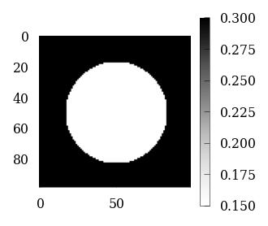
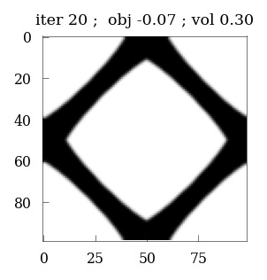
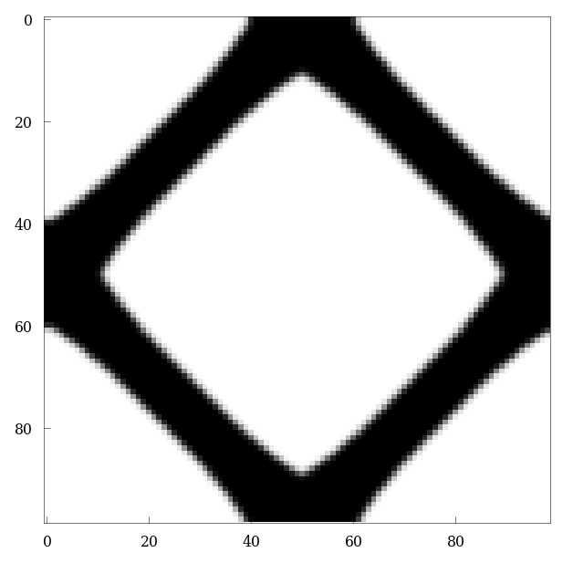
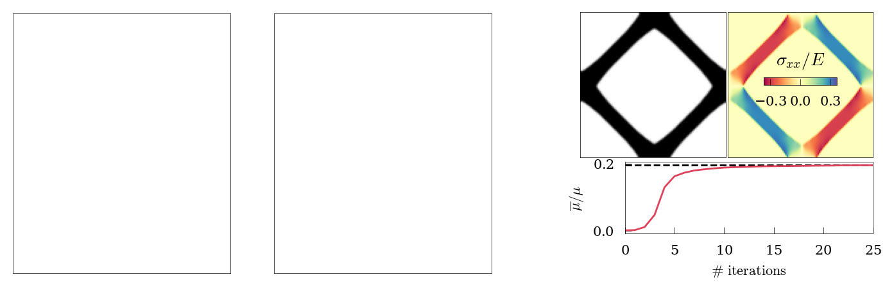

<div class="nb-header"><a href="https://colab.research.google.com/github/smec-ethz/xpektra/blob/main/notebooks/topology_optimization.ipynb" target="_blank"></a><a href="/assets/notebooks/topology_optimization.ipynb" download="topology_optimization.ipynb" class="nb-download-btn"><svg class="nb-download-icon" viewBox="0 0 24 24" xmlns="http://www.w3.org/2000/svg"><path d="M12 16l-6-6 1.41-1.41L11 13.17V4h2v9.17l3.59-3.58L18 11l-6 6z"/><path d="M5 18h14v2H5z"/></svg> Download</a></div>

```python
import jax

jax.config.update(
    "jax_compilation_cache_dir", "/cluster/scratch/mpundir/jax-cache-notebook"
)
import jax.numpy as jnp

jax.config.update("jax_enable_x64", True)  # use double-precision
jax.config.update("jax_platforms", "cpu")
import numpy as np

import functools
from jax.typing import ArrayLike
from jax import Array

from tqdm.notebook import tqdm
```


```python
import matplotlib.pyplot as plt
from skimage.morphology import disk, rectangle
import itertools
from matplotlib.gridspec import GridSpec
```


```python
import sys

sys.path.append("../fft_helpers/")

from projection_operators import compute_Ghat_4_2
import tensor_operators as tensor
from custom_solvers import conjugate_gradient

sys.path.append("../plot_helpers/")
plt.style.use(["../plot_helpers/prl_paper.mplstyle"])
from plot_helper_for_paper import set_size, plot_imshow, plot_contourf
```


\begin{align*}
    \underset{\rho}{ \text{maximize}} &:~ f(\rho, \boldsymbol{F}) \\
     \text{s.t} &: ~\mathcal{F}^{-1} \{ \mathcal{F} \{  \mathbb{G} \} :   \mathcal{F} \{ \sigma \} \}  = 0~, \\
                & : ~\int \rho(\boldsymbol{x}) d\Omega / \int d\Omega = \vartheta~,  \\
                & :~ 0 \leq \rho(\boldsymbol{x}) \leq 1 , \forall \boldsymbol{x} \in \Omega  
\end{align*}


The implementation of `Optimality criteria` and `sensitivity filter` has been taken from the work of Chandrasekhar et al [http://arxiv.org/abs/2104.01965](AuTO: A Framework for Automatic differentiation in Topology Optimization)


```python
# %% Filter
# Reference: http://arxiv.org/abs/2104.01965
def compute_filter(rmin):
    H = np.zeros((N * N, N * N))

    for i1 in range(N):
        for j1 in range(N):
            e1 = (i1) * N + j1
            imin = max(i1 - (np.ceil(rmin) - 1), 0.0)
            imax = min(i1 + (np.ceil(rmin)), N)
            for i2 in range(int(imin), int(imax)):
                jmin = max(j1 - (np.ceil(rmin) - 1), 0.0)
                jmax = min(j1 + (np.ceil(rmin)), N)
                for j2 in range(int(jmin), int(jmax)):
                    e2 = i2 * N + j2
                    H[e1, e2] = max(
                        0.0, rmin - np.sqrt((i1 - i2) ** 2 + (j1 - j2) ** 2)
                    )

    Hs = np.sum(H, 1)
    return H, Hs
```


```python
#length = 1.0
N = 99

# material parameters
elastic_modulus = {"max": 1.0, "min": 1e-3}  # N/mm2
poisson_modulus = 0.3
penalty = 5.0

vf = 0.3

dx = dy = 1.0
length = dx*N

H, Hs = compute_filter(rmin=1.3)
ft = {"type": 2, "H": H, "Hs": Hs}


μ = elastic_modulus['max'] / (2 * (1 + poisson_modulus))
λ = poisson_modulus * elastic_modulus['max'] / ((1 + poisson_modulus) * (1 - 2 * poisson_modulus))
λ = 2*μ*λ/(λ + 2*μ) # for plane stress
K = λ + 2 * μ / 2
print(μ*K*vf/(2*μ+2*K-(K+2*μ)*vf))

Hmax = μ*K/(K+2*μ)
```

    0.0470219435736677


```python
μ
```


    0.3846153846153846


```python
trial = vf/(Hmax+ μ) + (1-vf)/Hmax
```


```python
1/trial - Hmax
```


    0.04702194357366771


```python
ndim = 2
# identity tensor (single tensor)
i = jnp.eye(ndim)

# identity tensors (grid)
I = jnp.einsum("ij,xy", i, jnp.ones([N, N]))  # 2nd order Identity tensor

I4 = jnp.einsum(
    "ijkl,xy->ijklxy",
    jnp.einsum("il,jk", i, i),
    jnp.ones(
        [
            N,
        ]
        * ndim
    ),
)
I4rt = jnp.einsum(
    "ijkl,xy->ijklxy",
    jnp.einsum("ik,jl", i, i),
    jnp.ones(
        [
            N,
        ]
        * ndim
    ),
)


I4s = (I4 + I4rt) / 2.0
II = tensor.dyad22(I, I)
I4d = I4s - II / 3.0
```


```python
# (inverse) Fourier transform (for each tensor component in each direction)
@jax.jit
def fft(x):
    return jnp.fft.fftshift(jnp.fft.fftn(jnp.fft.ifftshift(x), [N, N]))


@jax.jit
def ifft(x):
    return jnp.fft.fftshift(jnp.fft.ifftn(jnp.fft.ifftshift(x), [N, N]))
```


```python
Ghat4_2 = compute_Ghat_4_2(NN=(N,) * ndim, operator="rotated", length=length)
```


```python
@jax.jit
def param(rho):
    rho = rho.reshape(N, N)
    E = (
        elastic_modulus["min"]
        + (elastic_modulus["max"] - elastic_modulus["min"]) * (rho + 0.01) ** penalty
    )
    return E
```


```python
# --------------------------#
# Reference: http://arxiv.org/abs/2104.01965
def get_initial_density(vf):
    rho = vf * np.ones((N, N))
    d = np.minimum(N, N) / 3.0
    ctr = 0
    for i in range(N):
        for j in range(N):
            r = np.sqrt((i - N / 2.0 - 0.5) ** 2 + (j - N / 2.0 - 0.5) ** 2)
            if r < d:
                rho[j, i] = vf / 2.0
            ctr += 1
    rho = rho.reshape(-1)
    return rho
```


```python
# Reference: http://arxiv.org/abs/2104.01965
def apply_sensitivity_filter(ft, x, dc, dv):
    if ft["type"] == 1:
        dc = np.matmul(ft["H"], np.multiply(x, dc) / ft["Hs"] / np.maximum(1e-3, x))
    elif ft["type"] == 2:
        dc = np.matmul(ft["H"], (dc / ft["Hs"]))
        dv = np.matmul(ft["H"], (dv / ft["Hs"]))
    return dc, dv
```


```python
# Reference: http://arxiv.org/abs/2104.01965
def oc(rho, dc, dv, ft, vf):
    l1 = 0

    l2 = 1e9
    x = rho.copy()
    move = 0.2
    while l2 - l1 > 1e-6:
        lmid = 0.5 * (l2 + l1)
        dr = np.abs(-dc / dv / lmid)

        xnew = np.maximum(
            0,
            np.maximum(x - move, np.minimum(1, np.minimum(x + move, x * np.sqrt(dr)))),
        )
        if ft["type"] == 1:
            rho = xnew
        elif ft["type"] == 2:
            rho = np.matmul(ft["H"], xnew) / ft["Hs"]
        if np.mean(rho) > vf:
            l1 = lmid
        else:
            l2 = lmid

    change = np.max(np.abs(xnew - x))
    return rho, change
```


```python
@jax.jit
def strain_energy(eps, rho):
    rho = rho.reshape(N, N)
    eps = eps.reshape(ndim, ndim, N, N)
    
    E = (
        elastic_modulus["min"]
        + (elastic_modulus["max"] - elastic_modulus["min"]) * (rho + 0.01) ** penalty
    )
    ν = jnp.ones_like(E) * poisson_modulus

    μ0 = E / (2 * (1 + ν))

    λ0 = ν * E / ((1 + ν) * (1 - 2 * ν))
    λ0 = 2*μ0*λ0/(λ0 + 2*μ0) # for plane stress


    eps_sym = 0.5 * (eps + tensor.trans2(eps))
    energy = 0.5 * jnp.multiply(λ0, tensor.trace2(eps_sym) ** 2) + jnp.multiply(
        μ0, tensor.trace2(tensor.dot22(eps_sym, eps_sym))
    )
    return energy.sum()


sigma = jax.jit(jax.jacrev(strain_energy, argnums=0))
```


```python
# functions for the projection 'G', and the product 'G : K : eps'
@jax.jit
def G(A2):
    return jnp.real(ifft(tensor.ddot42(Ghat4_2, fft(A2)))).reshape(-1)


@jax.jit
def G_K_deps(depsm, additionals):
    depsm = depsm.reshape(ndim, ndim, N, N)
    return G(sigma(depsm, additionals))
```


```python
@jax.jit
def scan_conjugate_gradient(state, n):
    x, b, F, Fn, additional, r, p, rsold, iiter, cg_tol = state
    x, b, additional, r, p, rsold = jax.device_put((x, b, additional, r, p, rsold))
      
    error = jnp.sqrt(rsold) 
    jax.debug.print('CG residual = {}', error)
    
    def true_fun(state):
        x, b, F, Fn, additional, r, p, rsold, iiter, cg_tol =  state

        Ap = G_K_deps(p, additional) 
        alpha = rsold / jnp.vdot(p, Ap)
        x = x + jnp.dot(alpha, p)
        r = r - jnp.dot(alpha, Ap)
        rsnew = jnp.vdot(r, r) 
        p = r + (rsnew/rsold)*p
        rsold = rsnew
        iiter = iiter + 1
        return (x, b, F, Fn, additional, r, p, rsold, iiter, cg_tol)

    def false_fun(state):
        return state

    return jax.lax.cond(error > cg_tol, true_fun, false_fun, state), n

@jax.jit
def scan_newton_raphson(state, n):
    #jax.debug.print('NR loop')
    dF, b, F, Fn, additional, r, p, rsold, iiter, cg_tol = state


    error = jnp.linalg.norm(dF)/Fn
    
    #jax.debug.print('NR residual={}', error)

    def true_fun(state):
        dF, b, F, Fn, additional, r, p, rsold, iiter, cg_tol = state

        x = jnp.zeros_like(b)
        r = b - G_K_deps(x, additional)
        p = r
        rsold = jnp.vdot(r, r) 

        state = (x, b, F, Fn, additional, r, p, rsold, iiter, cg_tol)
        
        state, xs = jax.lax.scan(scan_conjugate_gradient, 
                               init=state, 
                               xs=jnp.arange(0, 20))
        
        dF, b, F, Fn, additional, r, p, rsold, iiter, cg_tol = state

        dF     = dF.reshape(ndim,ndim,N,N)
        F      = jax.lax.add(F, dF)         # update DOFs (array -> tensor.grid)
        b      = -G_K_deps(F, additional)        # compute residual

        return (dF.reshape(-1), b, F, Fn, additional, r, p, rsold, iiter, cg_tol)

    def false_fun(state):
        return state

    return jax.lax.cond(error > 1e-8, true_fun, false_fun, state), n
```


```python
@jax.jit
def local_constitutive_update(macro_strain, rho):
    eps = jnp.zeros([ndim, ndim, N, N])

    deps = jnp.zeros([ndim, ndim, N, N])
    deps = deps.at[0, 0].set(macro_strain[0])
    deps = deps.at[1, 1].set(macro_strain[1])
    deps = deps.at[0, 1].set(macro_strain[2] / 2.0)
    deps = deps.at[1, 0].set(macro_strain[2] / 2.0)

    # initial residual: distribute "DE" over grid using "K4"
    b = -G_K_deps(deps, rho)
    eps = jax.lax.add(eps, deps)
    En = jnp.linalg.norm(eps)

    # passing parameters for conjugate gradient
    deps     = deps.reshape(-1)
    r        = jnp.zeros_like(b)
    p        = jnp.zeros_like(b) 
    rsold    = 0.
    iiter    = 0.
    cg_tol   = 1e-8
    
    state    = (deps, b, eps, En, rho,  r, p, rsold, iiter, cg_tol)
    
    
    #state = (deps, b, eps, En, rho)
    state = jax.device_put(state)

    final_state, xs = jax.lax.scan(
        scan_newton_raphson, init=state, xs=jnp.arange(0, 20)
    )

    sig = sigma(final_state[2], rho)

    # get the macro stress
    macro_sigma = jnp.array([jnp.sum(sig.at[0, 0].get()*dx*dy), 
                             jnp.sum(sig.at[1, 1].get()*dx*dy), 
                             0.5*(jnp.sum(sig.at[1, 0].get()*dx*dy) + jnp.sum(sig.at[0, 1].get()*dx*dy))])
    macro_sigma = macro_sigma/length**2

    return macro_sigma


tangent_operator = jax.jit(jax.jacfwd(
    local_constitutive_update, argnums=0, has_aux=False
))
```


```python
@jax.jit
def compute_objective(rho):
    rho = rho.reshape(N, N)

    macro_strain = jnp.array([1.0, 1.0, 1.])

    Cmacro = tangent_operator(macro_strain, rho)
    shear_modulus = Cmacro.at[2, 2].get()
    bulk_modulus = (Cmacro.at[0, 0].get() + Cmacro.at[1, 1].get() + Cmacro.at[0, 1].get() + Cmacro.at[1, 0].get())/4 
    poisson = (Cmacro.at[1, 0].get() + Cmacro.at[0, 1].get())/(Cmacro.at[0, 0].get() + Cmacro.at[1, 1].get())
    J = -shear_modulus
    #J = -poisson
    #J = -bulk_modulus
    '''eps = jnp.zeros([ndim, ndim, N, N])

    deps = jnp.zeros([ndim, ndim, N, N])
    deps = deps.at[0, 0].set(macro_strain[0])
    deps = deps.at[1, 1].set(macro_strain[1])
    deps = deps.at[0, 1].set(macro_strain[2] / 2.0)
    deps = deps.at[1, 0].set(macro_strain[2] / 2.0)

    # initial residual: distribute "DE" over grid using "K4"
    b = -G_K_deps(deps, rho)
    eps = jax.lax.add(eps, deps)
    En = jnp.linalg.norm(eps)

    # passing parameters for conjugate gradient
    deps     = deps.reshape(-1)
    #deps2    = jnp.zeros([ndim,ndim,N,N])
    r        = jnp.zeros_like(b)
    p        = jnp.zeros_like(b) 
    rsold    = 0.
    iiter    = 0.
    cg_tol   = 1e-10
    
    state    = (deps, b, eps, En, rho,  r, p, rsold, iiter, cg_tol)
    
    
    #state = (deps, b, eps, En, rho)
    state = jax.device_put(state)

    final_state, xs = jax.lax.scan(
        scan_newton_raphson, init=state, xs=jnp.arange(0, 20)
    )

    # return macro_sigma
    total_energy = 2*strain_energy(final_state[2], rho) #* length * length

    J = -(total_energy)/(N*N)'''
    jax.debug.print('J={}', J)

    return J, J


objective_handle = jax.jit(jax.jacrev(compute_objective, has_aux=True))
```


```python
from jax import random

key = random.key(2)
```


```python
rho = get_initial_density(vf=vf)
#rho=random.uniform(key, shape=(N, N))
plt.figure(figsize=(2,2))
plt.imshow(rho.reshape(N, N), cmap='Greys')
plt.colorbar()
```


    <matplotlib.colorbar.Colorbar at 0x1534fdba6350>


    

    


```python
compute_objective(rho)
```

    CG residual = 0.19215160248560498
    CG residual = 0.03345801064545514
    CG residual = 0.022725244309689748
    CG residual = 0.0021253379410087654
    CG residual = 0.001529706416414285
    CG residual = 0.0005935165225546164
    CG residual = 0.0002536036955032072
    CG residual = 0.0001960918878238921
    CG residual = 6.989287153370691e-05
    CG residual = 3.760377319774217e-05
    CG residual = 1.7913117236356724e-05
    CG residual = 4.357326472072343e-06
    CG residual = 3.587074687253273e-06
    CG residual = 1.0326111687990387e-06
    CG residual = 5.653929164246273e-07
    CG residual = 3.9625023224069544e-07
    CG residual = 1.208386419206797e-07
    CG residual = 7.332997495460921e-08
    CG residual = 2.9781698163273268e-08
    CG residual = 1.0437096819147349e-08
    CG residual = 7.355661187859818e-09
    CG residual = 7.355661187859818e-09
    CG residual = 7.355661187859818e-09
    CG residual = 7.355661187859818e-09
    CG residual = 7.355661187859818e-09
    CG residual = 7.355661187859818e-09
    CG residual = 7.355661187859818e-09
    CG residual = 7.355661187859818e-09
    CG residual = 7.355661187859818e-09
    CG residual = 7.355661187859818e-09
    CG residual = 7.355661187859818e-09
    CG residual = 7.355661187859818e-09
    CG residual = 7.355661187859818e-09
    CG residual = 7.355661187859818e-09
    CG residual = 7.355661187859818e-09
    CG residual = 7.355661187859818e-09
    CG residual = 7.355661187859818e-09
    CG residual = 7.355661187859818e-09
    CG residual = 7.355661187859818e-09
    CG residual = 7.355661187859818e-09
    J=-0.0008787942863382298


    (Array(-0.00087879, dtype=float64), Array(-0.00087879, dtype=float64))


```python
def optimize(maxIter=100):
    rho = jnp.array(get_initial_density(vf))
    change, loop = 10.0, 0

    objective_values = []
    
    while change > 0.01 and loop < maxIter:
        loop += 1
        dc, c = objective_handle(rho)

        dv = jnp.ones((N * N))
        dc, dv = apply_sensitivity_filter(ft, rho, dc, dv)

        rho, change = oc(rho, dc, dv, ft, vf)
        rho = jnp.array(rho)
        status = "iter {:d} ;  obj {:.2F} ; vol {:.2F}".format(loop, c, jnp.mean(rho))
        objective_values.append(c)
        if loop % 20 == 0:
            plt.figure(figsize=(2, 2))
            plt.imshow(-rho.reshape((N, N)), cmap="gray")
            plt.title(status)
            plt.show()

        print(status, "change {:.2F}".format(change))
    plt.imshow(-rho.reshape((N, N)), cmap="gray")

    return rho, objective_values
```


```python
rho, objective_values = optimize(50)
```

    J=-0.0008787942863382298
    iter 1 ;  obj -0.00 ; vol 0.22 change 0.17
    J=-0.0011264292428687427
    iter 2 ;  obj -0.00 ; vol 0.23 change 0.20
    J=-0.004658982855837879
    iter 3 ;  obj -0.00 ; vol 0.28 change 0.20
    J=-0.018540684887511497
    iter 4 ;  obj -0.02 ; vol 0.30 change 0.20
    J=-0.05008469804326539
    iter 5 ;  obj -0.05 ; vol 0.30 change 0.20
    J=-0.06264786596329028
    iter 6 ;  obj -0.06 ; vol 0.30 change 0.20
    J=-0.06676397728363354
    iter 7 ;  obj -0.07 ; vol 0.30 change 0.20
    J=-0.06930372871575895
    iter 8 ;  obj -0.07 ; vol 0.30 change 0.20
    J=-0.07066291773856068
    iter 9 ;  obj -0.07 ; vol 0.30 change 0.20
    J=-0.07173360640108709
    iter 10 ;  obj -0.07 ; vol 0.30 change 0.20
    J=-0.07259355408918161
    iter 11 ;  obj -0.07 ; vol 0.30 change 0.20
    J=-0.07303912658189629
    iter 12 ;  obj -0.07 ; vol 0.30 change 0.20
    J=-0.0734045811445772
    iter 13 ;  obj -0.07 ; vol 0.30 change 0.20
    J=-0.07375986215516153
    iter 14 ;  obj -0.07 ; vol 0.30 change 0.20
    J=-0.07410438109466494
    iter 15 ;  obj -0.07 ; vol 0.30 change 0.20
    J=-0.07423194254441018
    iter 16 ;  obj -0.07 ; vol 0.30 change 0.20
    J=-0.07431815311694735
    iter 17 ;  obj -0.07 ; vol 0.30 change 0.20
    J=-0.07443191402165845
    iter 18 ;  obj -0.07 ; vol 0.30 change 0.20
    J=-0.07458379112974596
    iter 19 ;  obj -0.07 ; vol 0.30 change 0.20
    J=-0.0747689063136045


    

    


    iter 20 ;  obj -0.07 ; vol 0.30 change 0.20
    J=-0.0748411880828251
    iter 21 ;  obj -0.07 ; vol 0.30 change 0.20
    J=-0.07495386007683479
    iter 22 ;  obj -0.07 ; vol 0.30 change 0.20
    J=-0.07516157320342541
    iter 23 ;  obj -0.08 ; vol 0.30 change 0.20
    J=-0.07517218876755548
    iter 24 ;  obj -0.08 ; vol 0.30 change 0.20
    J=-0.07526691061178795
    iter 25 ;  obj -0.08 ; vol 0.30 change 0.20
    J=-0.07514858970577003
    iter 26 ;  obj -0.08 ; vol 0.30 change 0.20
    J=-0.0752804842692488
    iter 27 ;  obj -0.08 ; vol 0.30 change 0.18
    J=-0.07522608497798886
    iter 28 ;  obj -0.08 ; vol 0.30 change 0.18
    J=-0.07517537991604127
    iter 29 ;  obj -0.08 ; vol 0.30 change 0.18
    J=-0.07512172231358034
    iter 30 ;  obj -0.08 ; vol 0.30 change 0.20
    J=-0.07520869691190356
    iter 31 ;  obj -0.08 ; vol 0.30 change 0.18
    J=-0.07513338635393747
    iter 32 ;  obj -0.08 ; vol 0.30 change 0.20
    J=-0.07521255448738662
    iter 33 ;  obj -0.08 ; vol 0.30 change 0.18
    J=-0.07513287188385283
    iter 34 ;  obj -0.08 ; vol 0.30 change 0.20
    J=-0.07520903409373031
    iter 35 ;  obj -0.08 ; vol 0.30 change 0.18
    J=-0.07512744859586072
    iter 36 ;  obj -0.08 ; vol 0.30 change 0.20
    J=-0.07520234757950907
    iter 37 ;  obj -0.08 ; vol 0.30 change 0.18
    J=-0.07511983423536299
    iter 38 ;  obj -0.08 ; vol 0.30 change 0.20
    J=-0.0751942141342333
    iter 39 ;  obj -0.08 ; vol 0.30 change 0.18
    J=-0.075111041857415


    

    


    iter 40 ;  obj -0.08 ; vol 0.30 change 0.20
    J=-0.07518533491640893
    iter 41 ;  obj -0.08 ; vol 0.30 change 0.18
    J=-0.0751017526410719
    iter 42 ;  obj -0.08 ; vol 0.30 change 0.20
    J=-0.07517606349066527
    iter 43 ;  obj -0.08 ; vol 0.30 change 0.19
    J=-0.07523601320525647
    iter 44 ;  obj -0.08 ; vol 0.30 change 0.18
    J=-0.07514937030673974
    iter 45 ;  obj -0.08 ; vol 0.30 change 0.20
    J=-0.07522147202405528
    iter 46 ;  obj -0.08 ; vol 0.30 change 0.18
    J=-0.07513685759584564
    iter 47 ;  obj -0.08 ; vol 0.30 change 0.20
    J=-0.0752102722182237
    iter 48 ;  obj -0.08 ; vol 0.30 change 0.18
    J=-0.07512612248099407
    iter 49 ;  obj -0.08 ; vol 0.30 change 0.20
    J=-0.07519981460437301
    iter 50 ;  obj -0.08 ; vol 0.30 change 0.18


    

    


```python
@jax.jit
def compute_local_stresses(macro_strain, rho):
    eps = jnp.zeros([ndim, ndim, N, N])

    deps = jnp.zeros([ndim, ndim, N, N])
    deps = deps.at[0, 0].set(macro_strain[0])
    deps = deps.at[1, 1].set(macro_strain[1])
    deps = deps.at[0, 1].set(macro_strain[2] / 2.0)
    deps = deps.at[1, 0].set(macro_strain[2] / 2.0)

    # initial residual: distribute "DE" over grid using "K4"
    b = -G_K_deps(deps, rho)
    eps = jax.lax.add(eps, deps)
    En = jnp.linalg.norm(eps)

    # passing parameters for conjugate gradient
    deps     = deps.reshape(-1)
    r        = jnp.zeros_like(b)
    p        = jnp.zeros_like(b) 
    rsold    = 0.
    iiter    = 0.
    cg_tol   = 1e-8
    
    state    = (deps, b, eps, En, rho,  r, p, rsold, iiter, cg_tol)
    
    
    #state = (deps, b, eps, En, rho)
    state = jax.device_put(state)

    final_state, xs = jax.lax.scan(
        scan_newton_raphson, init=state, xs=jnp.arange(0, 20)
    )

    sig = sigma(final_state[2], rho)
    return sig
```


```python
macro_strain = jnp.array([0.0, 0.0, 1.])
stresses = compute_local_stresses(macro_strain, rho)
```

    CG residual = 17.3171631235316
    CG residual = 3.3523559935266927
    CG residual = 1.1616458628170108
    CG residual = 0.7071048239993468
    CG residual = 0.4102551775383743
    CG residual = 0.2815996234262036
    CG residual = 0.2356726717604784
    CG residual = 0.20847552404537817
    CG residual = 0.14748031924978694
    CG residual = 0.13790977301764834
    CG residual = 0.09555820905314172
    CG residual = 0.08580380458913597
    CG residual = 0.07853635788754036
    CG residual = 0.06432296058473638
    CG residual = 0.05913485120473688
    CG residual = 0.040752123349128845
    CG residual = 0.03699377371342441
    CG residual = 0.02670692886935146
    CG residual = 0.027017180958343504
    CG residual = 0.02443745369940184
    CG residual = 0.023329746504566765
    CG residual = 0.016573304106826843
    CG residual = 0.016184892287336883
    CG residual = 0.016088822061484966
    CG residual = 0.017997440874972737
    CG residual = 0.017282984372111804
    CG residual = 0.01905502625590263
    CG residual = 0.016459220779385345
    CG residual = 0.016508583930901048
    CG residual = 0.014467484344715635
    CG residual = 0.013386594877818446
    CG residual = 0.013700845919777218
    CG residual = 0.011583517483394583
    CG residual = 0.011744693022309101
    CG residual = 0.010080186219952549
    CG residual = 0.009701584865823306
    CG residual = 0.008994643712855552
    CG residual = 0.008800253517534978
    CG residual = 0.007646875811179997
    CG residual = 0.006484185116276834
    CG residual = 0.005860817964100012
    CG residual = 0.004174286232995927
    CG residual = 0.005093758789299297
    CG residual = 0.0053002689702317
    CG residual = 0.0052837844471449345
    CG residual = 0.005820025935261828
    CG residual = 0.00552954027112976
    CG residual = 0.005208076580234989
    CG residual = 0.0047350407194471575
    CG residual = 0.004887106805985015
    CG residual = 0.004503373824963124
    CG residual = 0.004880255617988739
    CG residual = 0.004680525727009202
    CG residual = 0.004485749559815816
    CG residual = 0.004253276149679063
    CG residual = 0.0039571295391523376
    CG residual = 0.003836603712235234
    CG residual = 0.0035790462532483184
    CG residual = 0.0034873863895135133
    CG residual = 0.003320809057920338
    CG residual = 0.003912563794162428
    CG residual = 0.0026247582183317126
    CG residual = 0.0027630427962338955
    CG residual = 0.0025747230559226178
    CG residual = 0.002763196806603714
    CG residual = 0.00262308073536214
    CG residual = 0.002624652294991569
    CG residual = 0.0023861569593529508
    CG residual = 0.0024361350962829403
    CG residual = 0.002373193938592661
    CG residual = 0.002199882606036559
    CG residual = 0.0022419186086384975
    CG residual = 0.001982864425098146
    CG residual = 0.0020245957301639867
    CG residual = 0.001939511996725496
    CG residual = 0.0020214845009849055
    CG residual = 0.001843134309512655
    CG residual = 0.0018076878838298343
    CG residual = 0.001656343733409944
    CG residual = 0.0013827758491892924
    CG residual = 0.0016999910130068322
    CG residual = 0.0012012381167926121
    CG residual = 0.0014319086268878662
    CG residual = 0.001458508753509088
    CG residual = 0.0014411298759282414
    CG residual = 0.0015198845204966727
    CG residual = 0.0013916944958517982
    CG residual = 0.0013484581619970764
    CG residual = 0.001280665783842277
    CG residual = 0.0013589322818447214
    CG residual = 0.0012733877977523789
    CG residual = 0.0013242187374433957
    CG residual = 0.0012483216347096704
    CG residual = 0.0011916374320381578
    CG residual = 0.0011821533574942337
    CG residual = 0.0011453204980780673
    CG residual = 0.0011385814674744177
    CG residual = 0.0010431353631482592
    CG residual = 0.0010345471586212644
    CG residual = 0.00099143642205721
    CG residual = 0.0013242561271742796
    CG residual = 0.0008761529533843223
    CG residual = 0.0009047756281230862
    CG residual = 0.0008396478782083797
    CG residual = 0.000893126253961209
    CG residual = 0.000844486038875927
    CG residual = 0.0008409548036641117
    CG residual = 0.0007781711772505435
    CG residual = 0.0008078992097945254
    CG residual = 0.0007852227432426971
    CG residual = 0.0007341343382748298
    CG residual = 0.0007359772701094299
    CG residual = 0.0006611917280978151
    CG residual = 0.000666928908215778
    CG residual = 0.0006422143700955842
    CG residual = 0.0006750922125672805
    CG residual = 0.0006165234410457885
    CG residual = 0.0006051100158403431
    CG residual = 0.0005629837562040691
    CG residual = 0.00047735375660067206
    CG residual = 0.0006146614779908176
    CG residual = 0.0004353468169308583
    CG residual = 0.0005090569323735469
    CG residual = 0.0005143048647526107
    CG residual = 0.0005073905028594093
    CG residual = 0.000529595559366938
    CG residual = 0.0004880674753225269
    CG residual = 0.00047488056191233015
    CG residual = 0.0004611244224391031
    CG residual = 0.0004818317522894509
    CG residual = 0.0004587557291018851
    CG residual = 0.00046901043395642934
    CG residual = 0.0004495980340600795
    CG residual = 0.0004246670057201449
    CG residual = 0.0004203103469075535
    CG residual = 0.0004125204480322556
    CG residual = 0.0004080005207794566
    CG residual = 0.00038079054792948964
    CG residual = 0.00037733972258368763
    CG residual = 0.000368696794062289
    CG residual = 0.0005001045677999607
    CG residual = 0.0003347807696288297
    CG residual = 0.0003370492298221746
    CG residual = 0.000314949293069689
    CG residual = 0.00033107794267468103
    CG residual = 0.0003131963135632822
    CG residual = 0.0003135183651311962
    CG residual = 0.0002908923540236293
    CG residual = 0.0003070507562171024
    CG residual = 0.0002932465064036322
    CG residual = 0.00027987843417074174
    CG residual = 0.0002740946832876985
    CG residual = 0.0002540623244786837
    CG residual = 0.0002500017425248802
    CG residual = 0.00024401534140624923
    CG residual = 0.00025346891786530803
    CG residual = 0.00023450155132028548
    CG residual = 0.00023060750298295961
    CG residual = 0.00021701052357318276
    CG residual = 0.0001861239316187628
    CG residual = 0.00024010270683084978
    CG residual = 0.0001733214400910371
    CG residual = 0.0001986399989039067
    CG residual = 0.0002004120694819331
    CG residual = 0.00019737219157703925
    CG residual = 0.00020384150208078506
    CG residual = 0.0001908891879966368
    CG residual = 0.00018432282495130266
    CG residual = 0.00018319317119313498
    CG residual = 0.00018695947572546377
    CG residual = 0.00018279512412779507
    CG residual = 0.0001820405669849969
    CG residual = 0.0001797469992941219
    CG residual = 0.0001659061334172743
    CG residual = 0.00016690318685593365
    CG residual = 0.0001619127207779465
    CG residual = 0.00016157245518748955
    CG residual = 0.00015157152864757862
    CG residual = 0.00015135991168386016
    CG residual = 0.0001494546096063298
    CG residual = 0.00020319166206001006
    CG residual = 0.00013796030200630453
    CG residual = 0.00013591418418031623
    CG residual = 0.00012829993601787005
    CG residual = 0.00013296377298961683
    CG residual = 0.0001263423435824343
    CG residual = 0.00012697498614478957
    CG residual = 0.00011821583384328617
    CG residual = 0.0001257733666051128
    CG residual = 0.00011896434903924902
    CG residual = 0.00011540538523555699
    CG residual = 0.0001109352117118499
    CG residual = 0.00010552966588050976
    CG residual = 0.000101567345970207
    CG residual = 0.00010114279851044416
    CG residual = 0.00010283031733003709
    CG residual = 9.708656268860285e-05
    CG residual = 9.459423532077804e-05
    CG residual = 9.093038253262321e-05
    CG residual = 7.746781774148341e-05
    CG residual = 0.00010151863115369138
    CG residual = 7.333290002955632e-05
    CG residual = 8.367594229585413e-05
    CG residual = 8.367709187693055e-05
    CG residual = 8.269101182784499e-05
    CG residual = 8.453335779456711e-05
    CG residual = 8.026269937573052e-05
    CG residual = 7.726393414323977e-05
    CG residual = 7.75415046222592e-05
    CG residual = 7.837276646379975e-05
    CG residual = 7.77403922531682e-05
    CG residual = 7.639307612968293e-05
    CG residual = 7.670701347322298e-05
    CG residual = 6.988840448664775e-05
    CG residual = 7.136591821716271e-05
    CG residual = 6.814841449197702e-05
    CG residual = 6.904241888876632e-05
    CG residual = 6.4356698669396e-05
    CG residual = 6.550750762243108e-05
    CG residual = 6.429024940431493e-05
    CG residual = 8.912550407150587e-05
    CG residual = 6.0044313372574956e-05
    CG residual = 5.895841481415709e-05
    CG residual = 5.554204496655328e-05
    CG residual = 5.730888715560122e-05
    CG residual = 5.445168743893874e-05
    CG residual = 5.497593323692572e-05
    CG residual = 5.15087270740867e-05
    CG residual = 5.4595432964234325e-05
    CG residual = 5.185664375532854e-05
    CG residual = 5.0371873880283054e-05
    CG residual = 4.84250274314246e-05
    CG residual = 4.6210833342718284e-05
    CG residual = 4.4561800310484505e-05
    CG residual = 4.436566734612203e-05
    CG residual = 4.4994801737922304e-05
    CG residual = 4.2608714201351064e-05
    CG residual = 4.166536674732157e-05
    CG residual = 4.040388221863648e-05
    CG residual = 3.442291524820599e-05
    CG residual = 4.581610263963938e-05
    CG residual = 3.2893394555227586e-05
    CG residual = 3.739502906467577e-05
    CG residual = 3.725819284923438e-05
    CG residual = 3.674330899997372e-05
    CG residual = 3.7494976141317974e-05
    CG residual = 3.57510606235682e-05
    CG residual = 3.4610241907870724e-05
    CG residual = 3.463123010990612e-05
    CG residual = 3.5087391398273104e-05
    CG residual = 3.490103797086214e-05
    CG residual = 3.42772414783961e-05
    CG residual = 3.449610509611387e-05
    CG residual = 3.153149787165923e-05
    CG residual = 3.218545050373541e-05
    CG residual = 3.069176420790451e-05
    CG residual = 3.117885019018204e-05
    CG residual = 2.9171035536488597e-05
    CG residual = 2.9903387577307127e-05
    CG residual = 2.9371122135397543e-05
    CG residual = 4.1264227166800124e-05
    CG residual = 2.763579878184482e-05
    CG residual = 2.7061700593708593e-05
    CG residual = 2.5460481956892496e-05
    CG residual = 2.6187676552547233e-05
    CG residual = 2.48732639436774e-05
    CG residual = 2.520517742576712e-05
    CG residual = 2.3739845443547118e-05
    CG residual = 2.5066865044198958e-05
    CG residual = 2.389300329918019e-05
    CG residual = 2.325511583885304e-05
    CG residual = 2.235949809701977e-05
    CG residual = 2.136253336316919e-05
    CG residual = 2.0691803802039644e-05
    CG residual = 2.056038647728718e-05
    CG residual = 2.085128376721415e-05
    CG residual = 1.9771630106994194e-05
    CG residual = 1.942450165663391e-05
    CG residual = 1.892012144654408e-05
    CG residual = 1.6170299894963534e-05
    CG residual = 2.1739846312991224e-05
    CG residual = 1.554491757693706e-05
    CG residual = 1.7601526890574464e-05
    CG residual = 1.751296286852572e-05
    CG residual = 1.722760935785701e-05
    CG residual = 1.756665247610719e-05
    CG residual = 1.6792924259948993e-05
    CG residual = 1.6338627834302686e-05
    CG residual = 1.629803124064292e-05
    CG residual = 1.6545774941426115e-05
    CG residual = 1.6506149637581854e-05
    CG residual = 1.6205593272798843e-05
    CG residual = 1.63289130731022e-05
    CG residual = 1.4990296026560477e-05
    CG residual = 1.5281001601152565e-05
    CG residual = 1.4573190376624717e-05
    CG residual = 1.4830275858301117e-05
    CG residual = 1.3936051533350978e-05
    CG residual = 1.4336313503171944e-05
    CG residual = 1.4122880925138582e-05
    CG residual = 2.0018613393023773e-05
    CG residual = 1.3360182785410979e-05
    CG residual = 1.3044127068083456e-05
    CG residual = 1.2270487339166332e-05
    CG residual = 1.2586914467441254e-05
    CG residual = 1.1952008377729927e-05
    CG residual = 1.214400819956046e-05
    CG residual = 1.1486825006943525e-05
    CG residual = 1.2091664090060122e-05
    CG residual = 1.1554224281180159e-05
    CG residual = 1.1274305646448105e-05
    CG residual = 1.0836806400445963e-05
    CG residual = 1.0362786346889398e-05
    CG residual = 1.0081639835453661e-05
    CG residual = 1.0000731569805639e-05
    CG residual = 1.014593739521643e-05
    CG residual = 9.63467188260427e-06
    CG residual = 9.505502145431367e-06
    CG residual = 9.281270997354251e-06
    CG residual = 7.96520724256752e-06
    CG residual = 1.0780422161904852e-05
    CG residual = 7.689119682001772e-06
    CG residual = 8.673153683008412e-06
    CG residual = 8.62765175979466e-06
    CG residual = 8.467205042087124e-06
    CG residual = 8.62969677384413e-06
    CG residual = 8.264447598598213e-06
    CG residual = 8.07361046362547e-06
    CG residual = 8.032554736213193e-06
    CG residual = 8.167012137628476e-06
    CG residual = 8.170736135670207e-06
    CG residual = 8.019484120342883e-06
    CG residual = 8.08720998807746e-06
    CG residual = 7.4552079089680414e-06
    CG residual = 7.590338942395897e-06
    CG residual = 7.242115641034714e-06
    CG residual = 7.381865111901182e-06
    CG residual = 6.965372715804866e-06
    CG residual = 7.178115534180111e-06
    CG residual = 7.0974185481948e-06
    CG residual = 1.0121886977367916e-05
    CG residual = 6.741856659055299e-06
    CG residual = 6.563404800125279e-06
    CG residual = 6.177779777555416e-06
    CG residual = 6.321977443518438e-06
    CG residual = 6.002363157775516e-06
    CG residual = 6.110123287111571e-06
    CG residual = 5.800309381201743e-06
    CG residual = 6.089829113128733e-06
    CG residual = 5.8309873345682614e-06
    CG residual = 5.703292999427135e-06
    CG residual = 5.480417626101292e-06
    CG residual = 5.243256496505441e-06
    CG residual = 5.121971005624008e-06
    CG residual = 5.073206061342765e-06
    CG residual = 5.149917595871885e-06
    CG residual = 4.897398955324102e-06
    CG residual = 4.8499989794852575e-06
    CG residual = 4.741176992332272e-06
    CG residual = 4.086629415571959e-06
    CG residual = 5.555683077483027e-06
    CG residual = 3.956924507978842e-06
    CG residual = 4.447514952854448e-06
    CG residual = 4.42652948325624e-06
    CG residual = 4.334708569199043e-06
    CG residual = 4.416854981130802e-06
    CG residual = 4.234956335248105e-06
    CG residual = 4.151378661609985e-06
    CG residual = 4.120676769884227e-06
    CG residual = 4.195301856336743e-06
    CG residual = 4.207394388584518e-06
    CG residual = 4.128914941146097e-06
    CG residual = 4.165413909667022e-06
    CG residual = 3.854617090376713e-06
    CG residual = 3.919639383857708e-06
    CG residual = 3.742146259881563e-06
    CG residual = 3.81964809526914e-06
    CG residual = 3.617719505850707e-06
    CG residual = 3.7305932650021938e-06
    CG residual = 3.7028202351601207e-06
    CG residual = 5.30278128803775e-06
    CG residual = 3.5286761730824727e-06
    CG residual = 3.4258546803934477e-06
    CG residual = 3.2281147757093668e-06
    CG residual = 3.296249073512347e-06
    CG residual = 3.129764870152408e-06
    CG residual = 3.1898141486023506e-06
    CG residual = 3.0376405293981448e-06
    CG residual = 3.181803997402644e-06
    CG residual = 3.0520600656233835e-06
    CG residual = 2.991131206979761e-06
    CG residual = 2.873766005292978e-06
    CG residual = 2.7495413185053422e-06
    CG residual = 2.6959406737558447e-06
    CG residual = 2.666275475534144e-06
    CG residual = 2.708416586926194e-06
    CG residual = 2.5786304241215374e-06
    CG residual = 2.562265708622603e-06
    CG residual = 2.505420607144204e-06
    CG residual = 2.168589808696337e-06


```python
import matplotlib.gridspec as gridspec
from matplotlib import ticker

```


```python
fig = plt.figure(
    figsize=set_size(width="two-column", fraction=0.975, height_ratio=0.3),
    constrained_layout=False,
    dpi=200,
)
gs1 = gridspec.GridSpec(1, 2, figure=fig,  left=0.01, right=0.55, top=0.98, bottom=0.00)
gs2.update(wspace=0.1) # set the spacing between axes. 

ax = fig.add_subplot(gs1[:, 0])
ax.axes.get_xaxis().set_visible(False)
ax.axes.get_yaxis().set_visible(False)
ax = fig.add_subplot(gs1[:, 1])
ax.axes.get_xaxis().set_visible(False)
ax.axes.get_yaxis().set_visible(False)

gs2 = gridspec.GridSpec(2, 2, figure=fig, height_ratios=[1, 0.5], left=0.65, right=0.98, top=0.99)
gs2.update(hspace=0.1, wspace=0.01) # set the spacing between axes. 


ax = fig.add_subplot(gs2[0, 0])
ax.imshow(rho.reshape((N, N)), cmap="Greys")
ax.axes.get_xaxis().set_visible(False)
ax.axes.get_yaxis().set_visible(False)


ax = fig.add_subplot(gs2[0, 1])
cs = ax.imshow(stresses.at[0, 0].get(), cmap="Spectral")
ax.axes.get_xaxis().set_visible(False)
ax.axes.get_yaxis().set_visible(False)
axins1 = ax.inset_axes([0.25, 0.5, 0.5, 0.05])

cbar = fig.colorbar(cs, cax=axins1, pad=0.05, 
                      fraction=0.025, shrink=.5, orientation="horizontal")
tick_locator = ticker.MaxNLocator(nbins=2)
cbar.locator = tick_locator
cbar.update_ticks()
cbar.set_label('$\sigma_{xx}/E$', fontsize=10, labelpad=-32, y=0.85)
cbar.ax.yaxis.set_offset_position('right')  


gs3 = gridspec.GridSpec(1, 1, figure=fig, left=0.7, right=0.98, top=0.42,  bottom=0.15)
gs3.update(hspace=0.1, wspace=0.01) # set the spacing between axes. 
ax = fig.add_subplot(gs3[:, :])
ax.plot(-np.asarray(objective_values)/μ, color='#de425b')
ax.axhline(y=np.max(-np.asarray(objective_values)/μ), color='k', ls='dashed', zorder=-1)
ax.set_xlabel(r'$\mathrm{\#~iterations}$')
ax.set_ylabel(r'$\overline{\mu}/\mu$')
ax.set_xlim(left=0, right=25)

plt.savefig('../notebooks/figs/paper_to_shear_modulus.svg')
plt.show()
```


    

    


```python
μ
```


    0.3846153846153846


```python
0.5 0.132
0.3 0.075
```


      Cell In[79], line 1
        0.5 0.133
            ^
    SyntaxError: invalid syntax


```python

```


```python

```
